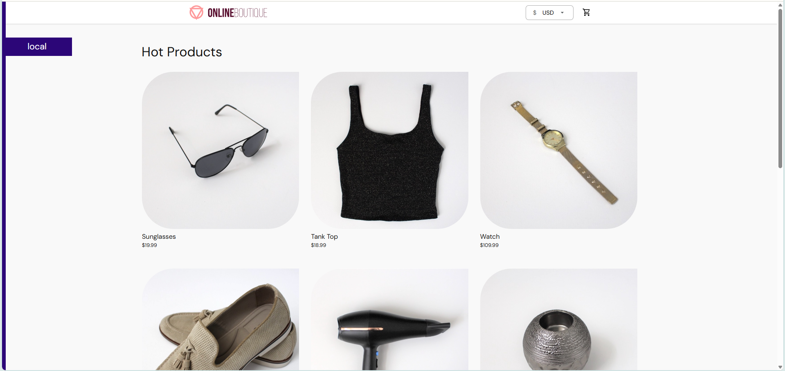
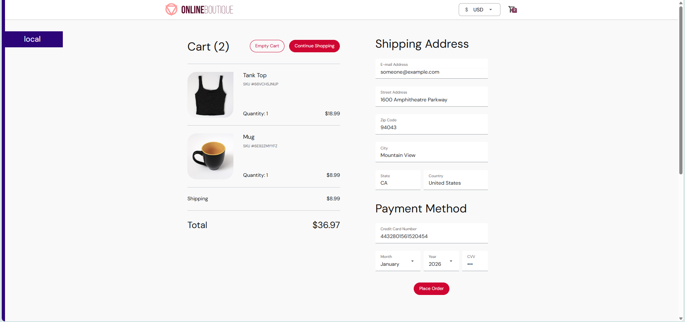

# Giới thiệu

Online Boutique là một ứng dụng thương mại điện tử mẫu do Google phát triển trong repository [GoogleCloudPlatform/microservices-demo](https://github.com/GoogleCloudPlatform/microservices-demo). Ứng dụng được thiết kế để trình diễn kiến trúc `microservices`, mô phỏng một website bán hàng hiện đại, vận hành thông qua **11 dịch vụ độc lập**.

Mục tiêu chính của Google khi xây dựng dự án này là giúp người học tiếp cận với mô hình `cloud-native`, thực hành `DevOps`, và hiểu sâu hơn về cách các `microservice` tương tác trong một hệ thống phân tán.

---

## 1. Mục đích của dự án Online Boutique

### 1.1. Minh họa kiến trúc microservices thực tế

Ứng dụng được chia thành **11 microservice**, mỗi service có một nhiệm vụ riêng, sử dụng nhiều ngôn ngữ lập trình khác nhau. Đây là mô hình phản ánh chính xác cách các hệ thống lớn được xây dựng ngoài đời thực.

**Đặc điểm nổi bật:**

- Mỗi service độc lập, có thể `scale` riêng biệt
- Sử dụng 5 ngôn ngữ khác nhau (`Go`, `Node.js`, `Python`, `C#`, `Java`)
- Giao tiếp qua `gRPC` (high-performance RPC framework)
- `Stateless design` cho hầu hết services
- Sử dụng `Redis` cho data persistence (cart service)

### 1.2. Làm bài lab DevOps

Online Boutique thường được sử dụng để thực hành:

- **Xây dựng quy trình CI/CD**: Automated testing, building, deployment
- **Container hóa bằng Docker**: Multi-stage builds, optimization
- **Logging, tracing, metrics**: Observability best practices
- **Monitoring với Prometheus hoặc Grafana**: Real-time monitoring dashboards
- **Giao tiếp giữa các microservice bằng gRPC**: High-performance communication
- **Load testing và đánh giá khả năng mở rộng**: Performance testing với Locust

### 1.3. Là ứng dụng mẫu cloud-native

Google sử dụng ứng dụng này trong nhiều workshop và hội thảo nhằm minh họa cách triển khai và vận hành hệ thống cloud-native trên:

- Google Kubernetes Engine (GKE)
- Amazon Web Services (EKS)
- Azure Kubernetes Service (AKS)
- Local development với Docker Compose

---

## 2. Architecture (Kiến trúc tổng thể)

### Sơ đồ kiến trúc


### Mô tả kiến trúc:

Online Boutique gồm một thành phần **frontend** phục vụ người dùng qua HTTP. Frontend đóng vai trò **cổng giao tiếp** và gọi tới toàn bộ backend microservice bằng **gRPC**.

Các service như `productcatalogservice`, `cartservice`, `paymentservice`, `recommendationservice`, `shippingservice`... hoạt động độc lập và phối hợp để xử lý luồng đặt hàng.

Một service đặc biệt là **`checkoutservice`**, đảm nhiệm vai trò **orchestrator** (tổng hợp):

- Lấy giỏ hàng từ `cartservice`
- Tính giá với `currencyservice`
- Xử lý thanh toán qua `paymentservice`
- Tính phí ship qua `shippingservice`
- Gửi email xác nhận qua `emailservice`

**Quản lý trạng thái:**

- Dữ liệu giỏ hàng được lưu trong **Redis**
- Các service còn lại hầu hết đều **stateless** (không lưu trạng thái)

**Communication pattern:**

- Frontend ↔ Backend: **gRPC** (Protocol Buffers)
- User ↔ Frontend: **HTTP/HTTPS**
- Cart Service ↔ Redis: **Redis Protocol**

---

## 3. Danh sách microservices và chức năng

Bảng dưới đây mô tả chi tiết từng service trong hệ thống:

| Service                   | Ngôn ngữ      | Port  | Mô tả chức năng                                                                 |
| ------------------------- | ------------- | ----- | ------------------------------------------------------------------------------- |
| **frontend**              | Go            | 8080  | Xử lý request từ người dùng, hiển thị giao diện web, gọi backend thông qua gRPC |
| **productcatalogservice** | Go            | 3550  | Cung cấp danh sách sản phẩm từ file JSON, quản lý catalog                       |
| **cartservice**           | C#            | 7070  | Lưu trữ giỏ hàng người dùng bằng Redis, xử lý thêm/xóa/cập nhật items           |
| **currencyservice**       | Node.js       | 7000  | Chuyển đổi đơn vị tiền tệ (USD, EUR, JPY, CAD, etc.)                            |
| **paymentservice**        | Node.js       | 50051 | Xử lý thanh toán mô phỏng (mock credit card processing)                         |
| **shippingservice**       | Go            | 50052 | Tính phí vận chuyển dựa trên địa chỉ và số lượng items                          |
| **emailservice**          | Python        | 8082  | Gửi email xác nhận đơn hàng (mock SMTP)                                         |
| **checkoutservice**       | Go            | 5050  | Tổng hợp dữ liệu từ nhiều service để tạo đơn hàng (orchestrator)                |
| **recommendationservice** | Python        | 8081  | Gợi ý sản phẩm bổ sung dựa trên lịch sử và sản phẩm hiện tại                    |
| **adservice**             | Java          | 9555  | Cung cấp nội dung quảng cáo văn bản contextual ads                              |
| **loadgenerator**         | Python/Locust | N/A   | Sinh lưu lượng truy cập để kiểm thử tải (load testing)                          |

### Chi tiết kỹ thuật:

**Storage & Cache:**

- **Redis**: Sử dụng cho Cart Service để lưu session data
- **In-memory**: Product catalog được load từ JSON file vào memory

**Communication:**

- **gRPC**: Tất cả inter-service communication
- **HTTP REST**: Frontend serving static assets
- **Protocol Buffers**: Message serialization

**Frameworks:**

- Go: Standard library + gRPC
- Node.js: Express.js + gRPC
- Python: Flask + gRPC
- C#: ASP.NET Core + gRPC
- Java: Spring Boot + gRPC

---

## 4. Screenshots giao diện ứng dụng

### Home Page - Trang chủ



**Mô tả:**

- Hiển thị danh sách sản phẩm (từ `productcatalogservice`)
- Banner quảng cáo (từ `adservice`)
- Navigation menu
- Shopping cart icon với số lượng items
- Currency selector (chuyển đổi tiền tệ)

### Checkout Screen - Trang thanh toán



**Mô tả:**

- Hiển thị giỏ hàng (từ `cartservice`)
- Tổng giá trị đơn hàng (qua `currencyservice`)
- Phí vận chuyển (từ `shippingservice`)
- Form thông tin người nhận (shipping address)
- Thông tin thẻ tín dụng (credit card form)
- Nút "Place Order" để hoàn tất đơn hàng

**Giao diện được cung cấp bởi:**

- `frontend` service render HTML templates
- Toàn bộ dữ liệu được tổng hợp từ các microservice phía backend qua gRPC

---

## 5. Luồng hoạt động của ứng dụng

### 5.1. Luồng xem sản phẩm (Browse Products)

```
User → Frontend → Product Catalog Service
                ↓
            Ad Service
```

**Chi tiết:**

1. User truy cập trang chủ http://localhost:8080
2. `frontend` gọi `productcatalogservice.ListProducts()` để lấy danh sách sản phẩm
3. `frontend` gọi `adservice.GetAds()` để lấy quảng cáo contextual
4. Frontend render HTML với dữ liệu products + ads
5. User xem danh sách và click vào sản phẩm

**gRPC calls:**

```
// Get all products
rpc ListProducts(Empty) returns (ListProductsResponse)

// Get ads based on context
rpc GetAds(AdRequest) returns (AdResponse)
```

### 5.2. Luồng thêm vào giỏ hàng (Add to Cart)

```
User → Frontend → Cart Service → Redis
```

**Chi tiết:**

1. User click "Add to Cart" button
2. `frontend` gọi `cartservice.AddItem(userId, productId, quantity)`
3. `cartservice` lưu thông tin vào **Redis**:
   - Key: `cart:{userId}`
   - Value: List of {productId, quantity}
4. Redis trả về confirmation
5. Frontend cập nhật UI (cart icon badge)

**gRPC calls:**

```
// Add item to cart
rpc AddItem(AddItemRequest) returns (Empty)

// Get cart contents
rpc GetCart(GetCartRequest) returns (Cart)
```

**Redis operations:**

```redis
HSET cart:user123 product_OLJCESPC7Z 1
HSET cart:user123 product_66VCHSJNUP 2
```

### 5.3. Luồng checkout (Place Order)

Đây là luồng phức tạp nhất, `checkoutservice` đóng vai trò **orchestrator** và gọi nhiều services:

```
User → Frontend → Checkout Service (Orchestrator)
                      ↓
    ┌─────────────────┼─────────────────┐
    ↓                 ↓                 ↓
Cart Service    Currency Service   Product Catalog
    ↓                 ↓                 ↓
 Get Cart        Convert Price    Get Product Info

                Checkout Service
                      ↓
    ┌─────────────────┼─────────────────┐
    ↓                 ↓                 ↓
Shipping Service  Payment Service  Email Service
    ↓                 ↓                 ↓
Calculate Ship    Process Payment  Send Confirmation
```

**Chi tiết từng bước:**

**Bước 1: Prepare Order Data**

1. User điền form và click "Place Order"
2. `frontend` gọi `checkoutservice.PlaceOrder()`
3. `checkoutservice` lấy giỏ hàng:
   ```
   cart = cartservice.GetCart(userId)
   ```

**Bước 2: Get Product Details** 4. `checkoutservice` lấy thông tin chi tiết sản phẩm:

```
for item in cart:
    product = productcatalogservice.GetProduct(item.productId)
```

**Bước 3: Currency Conversion** 5. `checkoutservice` chuyển đổi tiền tệ nếu cần:

```
convertedPrice = currencyservice.Convert(
    from: "USD",
    to: userCurrency,
    amount: totalPrice
)
```

**Bước 4: Calculate Shipping** 6. `checkoutservice` tính phí vận chuyển:

```
shippingCost = shippingservice.GetQuote(
    address: shippingAddress,
    items: cart.items
)
```

**Bước 5: Process Payment** 7. `checkoutservice` xử lý thanh toán:

```
paymentResult = paymentservice.Charge(
    amount: totalPrice + shippingCost,
    creditCard: creditCardInfo
)
```

**Bước 6: Send Confirmation Email** 8. `checkoutservice` gửi email xác nhận:

```
emailservice.SendOrderConfirmation(
    email: userEmail,
    order: orderDetails
)
```

**Bước 7: Clear Cart** 9. `checkoutservice` xóa giỏ hàng:

```
cartservice.EmptyCart(userId)
```

**Bước 8: Return Order ID** 10. `checkoutservice` trả về `orderId` cho frontend 11. Frontend hiển thị trang "Order Confirmation" với `orderId`

**Error Handling:**

- Nếu bất kỳ step nào fail → rollback và return error
- Payment fail → không charge, không gửi email
- Email fail → order vẫn được tạo (non-critical)

---

## 6. Tổng kết

### Điểm mạnh của kiến trúc

- **Separation of Concerns**: Mỗi service có một nhiệm vụ rõ ràng
- **Technology Diversity**: Sử dụng ngôn ngữ phù hợp cho từng service
- **Scalability**: Có thể scale từng service độc lập
- **Resilience**: Lỗi một service không làm sập toàn hệ thống
- **Maintainability**: Dễ maintain và update từng phần

### Thách thức (Challenges)

- **Complexity**: Nhiều services → phức tạp hơn monolith
- **Debugging**: Khó debug distributed system
- **Network latency**: Nhiều gRPC calls → latency tích lũy
- **Data consistency**: Không có distributed transaction
- **Deployment**: Cần orchestration tools (Kubernetes)

### Bài học rút ra

- **Microservices không phải cho mọi project**: Cần cân nhắc trade-offs
- **Observability là must-have**: Logging, tracing, metrics rất quan trọng
- **Service mesh có thể giúp**: Istio, Linkerd giúp quản lý communication
- **gRPC performance tốt**: Nhanh hơn REST, nhưng khó debug hơn
- **Stateless design**: Giúp scale dễ dàng hơn

---

## 7. Hướng phát triển tiếp theo

Trong các bài tiếp theo, chúng ta sẽ:

- **Deep dive từng service**: Phân tích source code chi tiết
- **Docker Compose setup**: Chạy local development environment
- **Monitoring & Observability**: Setup Prometheus, Grafana, Jaeger
- **Deploy lên Kubernetes**: Production deployment
- **CI/CD Pipeline**: Automated testing và deployment

Stay tuned!

---

## Resources

- **GitHub Repository**: https://github.com/GoogleCloudPlatform/microservices-demo
- **Official Documentation**: https://github.com/GoogleCloudPlatform/microservices-demo/tree/main/docs
- **Architecture Diagram**: https://github.com/GoogleCloudPlatform/microservices-demo/blob/main/docs/img/architecture-diagram.png

---

**Tags:** #microservices #google-cloud #architecture #grpc #docker #kubernetes #devops

**Published:** November 14, 2025
**Reading time:** ~12 minutes
**Difficulty:** Intermediate
