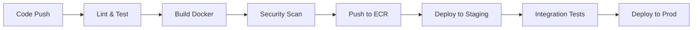

## Giới thiệu Series

Chào mừng đến với series **Deploy Microservices - Full DevOps Stack**!

Trong series này, chúng ta sẽ đi từ A-Z để deploy một hệ thống microservices hoàn chỉnh lên production, bao gồm:

- Infrastructure as Code với Terraform
- Container orchestration với Kubernetes
- CI/CD automation với GitHub Actions
- Monitoring & Logging với Prometheus, Grafana, ELK
- Service Mesh với Istio
- Security best practices

## Demo Application

Chúng ta sẽ deploy **Google Online Boutique** - một ứng dụng e-commerce microservices thực tế:

```
┌─────────────────────────────────────────────────┐
│           Online Boutique Architecture          │
├─────────────────────────────────────────────────┤
│  Frontend (React)                               │
│    ↓                                            │
│  API Gateway                                    │
│    ↓                                            │
│  ┌──────────┬──────────┬──────────┬──────────┐ │
│  │ Product  │  Cart    │ Checkout │ Payment  │ │
│  │ Service  │ Service  │ Service  │ Service  │ │
│  └──────────┴──────────┴──────────┴──────────┘ │
│  ┌──────────┬──────────┬──────────┬──────────┐ │
│  │ Currency │ Shipping │  Email   │   Ad     │ │
│  │ Service  │ Service  │ Service  │ Service  │ │
│  └──────────┴──────────┴──────────┴──────────┘ │
│                                                 │
│  Database: PostgreSQL, Redis                    │
└─────────────────────────────────────────────────┘
```

### Các services:

1. **Frontend** - React UI
2. **Product Catalog** - Browse products
3. **Cart Service** - Shopping cart management
4. **Checkout Service** - Order processing
5. **Payment Service** - Payment processing
6. **Currency Service** - Multi-currency support
7. **Shipping Service** - Shipping calculations
8. **Email Service** - Email notifications
9. **Ad Service** - Recommendations
10. **Load Generator** - Traffic simulation

## Tech Stack Overview

### Infrastructure Layer

```yaml
Cloud Provider: AWS
IaC Tool: Terraform
Regions: Multi-region setup
Networking: VPC, Subnets, Security Groups
```

**Components:**
- **VPC**: Isolated network
- **EKS**: Managed Kubernetes
- **RDS**: PostgreSQL database
- **ElastiCache**: Redis cache
- **S3**: Object storage
- **CloudWatch**: Logs & metrics

### Container Layer

```yaml
Container Runtime: Docker
Registry: Amazon ECR
Build: Multi-stage Dockerfiles
Optimization: Alpine base images
```

**Best practices:**
- Multi-stage builds để giảm image size
- Security scanning với Trivy
- Layer caching optimization
- Health checks

### Orchestration Layer

```yaml
Platform: Kubernetes (EKS)
Version: 1.28+
CNI: Amazon VPC CNI
Storage: EBS CSI Driver
```

**Kubernetes Resources:**
- **Deployments**: Application workloads
- **Services**: Service discovery
- **Ingress**: External access
- **ConfigMaps/Secrets**: Configuration
- **HPA**: Auto-scaling
- **PDB**: High availability

### CI/CD Pipeline

```yaml
Version Control: GitHub
CI/CD: GitHub Actions
Artifact Registry: ECR
GitOps: ArgoCD (optional)
```

**Pipeline stages:**



### Monitoring Stack

```yaml
Metrics: Prometheus + Grafana
Logs: ELK Stack (Elasticsearch, Logstash, Kibana)
Tracing: Jaeger
Alerting: AlertManager + Slack
```

**What we monitor:**
- Application metrics (request rate, latency, errors)
- Infrastructure metrics (CPU, memory, disk)
- Business metrics (orders, revenue)
- Custom metrics per service

### Service Mesh (Optional - Advanced)

```yaml
Service Mesh: Istio
Traffic Management: Intelligent routing
Security: mTLS, authorization
Observability: Enhanced tracing
```

## Roadmap Series

### Phase 1: Foundation (Bài 1-3)

**Bài 1** - Giới thiệu kiến trúc ✅ (bài này)

**Bài 2** - Setup Infrastructure với Terraform
- Tạo VPC, Subnets
- Setup EKS cluster
- Configure RDS, ElastiCache
- Security groups và IAM roles

**Bài 3** - Containerize Applications
- Multi-stage Dockerfiles
- Optimize image size
- Health checks và probes
- Push to ECR

### Phase 2: Deployment (Bài 4-6)

**Bài 4** - Deploy lên Kubernetes
- Kubernetes manifests (Deployments, Services)
- ConfigMaps và Secrets
- Ingress setup
- Database migrations

**Bài 5** - CI/CD Pipeline với GitHub Actions
- Automated testing
- Docker build và push
- Automated deployment
- Rollback strategies

**Bài 6** - Auto-scaling và High Availability
- Horizontal Pod Autoscaler (HPA)
- Cluster Autoscaler
- Pod Disruption Budgets
- Multi-zone deployment

### Phase 3: Observability (Bài 7-8)

**Bài 7** - Monitoring với Prometheus và Grafana
- Install Prometheus Operator
- Service monitors
- Grafana dashboards
- Alerting rules

**Bài 8** - Logging với ELK Stack
- Centralized logging
- Log aggregation
- Kibana dashboards
- Log-based alerts

### Phase 4: Advanced (Bài 9-10)

**Bài 9** - Service Mesh với Istio
- Traffic management
- Circuit breaking
- Retry policies
- Observability enhancements

**Bài 10** - Security Best Practices
- Network policies
- RBAC configuration
- Secrets management (Vault)
- Image scanning
- Runtime security

## Prerequisites

Để follow series này, bạn cần:

### Required Knowledge:
- ✅ Basic Linux commands
- ✅ Git basics
- ✅ Docker fundamentals
- ✅ Basic Kubernetes concepts
- ✅ AWS basics

### Tools Installation:

```bash
# Docker
docker --version

# kubectl
kubectl version --client

# Terraform
terraform --version

# AWS CLI
aws --version

# Helm
helm version
```

### AWS Account:
- Account với billing enabled
- IAM user với admin permissions (hoặc specific permissions)
- Access key và secret key configured

**Cost estimate**: ~$50-100/tháng cho development environment

## Local Development Setup

Trước khi deploy lên cloud, test local với:

### Option 1: Docker Compose

```bash
# Clone application
git clone https://github.com/GoogleCloudPlatform/microservices-demo.git
cd microservices-demo

# Run with Docker Compose
docker-compose up

# Access
# Frontend: http://localhost:8080
```

### Option 2: Minikube

```bash
# Start Minikube
minikube start --cpus=4 --memory=8192

# Deploy application
kubectl apply -f ./release/kubernetes-manifests.yaml

# Expose frontend
kubectl port-forward svc/frontend 8080:80

# Access
# http://localhost:8080
```

### Verify Services:

```bash
# Check all pods running
kubectl get pods

# Check services
kubectl get svc

# Check logs
kubectl logs -f deployment/frontend
```

## Architecture Patterns

### Microservices Communication

**Synchronous (REST):**
```
Frontend → Product Service (HTTP/REST)
Frontend → Cart Service (HTTP/REST)
```

**Asynchronous (Message Queue - Optional):**
```
Checkout → Email Service (via RabbitMQ)
Payment → Notification Service (via Kafka)
```

### Data Management

**Database per Service:**
- Product Service → PostgreSQL (products table)
- Cart Service → Redis (session cache)
- Order Service → PostgreSQL (orders table)

**Shared Database (Anti-pattern - avoid!):**
```
❌ All services → Single database
```

### API Gateway Pattern

```
Client Requests
    ↓
API Gateway (Kong/NGINX)
    ↓
┌────────┬────────┬────────┐
│Service │Service │Service │
│   A    │   B    │   C    │
└────────┴────────┴────────┘
```

Benefits:
- Single entry point
- Authentication/Authorization
- Rate limiting
- Request routing

## Key Concepts

### 1. Containerization

Mỗi service chạy trong container riêng:

```dockerfile
# Example: Product Service
FROM golang:1.21-alpine AS builder
WORKDIR /app
COPY . .
RUN go build -o product-service

FROM alpine:latest
RUN apk --no-cache add ca-certificates
COPY --from=builder /app/product-service .
CMD ["./product-service"]
```

### 2. Service Discovery

Kubernetes tự động service discovery:

```yaml
apiVersion: v1
kind: Service
metadata:
  name: product-service
spec:
  selector:
    app: product
  ports:
  - port: 8080
```

Other services access via DNS: `http://product-service:8080`

### 3. Configuration Management

```yaml
# ConfigMap
apiVersion: v1
kind: ConfigMap
metadata:
  name: app-config
data:
  DATABASE_HOST: "postgres.default.svc"
  CACHE_HOST: "redis.default.svc"

---
# Secret
apiVersion: v1
kind: Secret
metadata:
  name: app-secret
data:
  DATABASE_PASSWORD: <base64-encoded>
```

### 4. Health Checks

```yaml
livenessProbe:
  httpGet:
    path: /healthz
    port: 8080
  initialDelaySeconds: 10
  periodSeconds: 5

readinessProbe:
  httpGet:
    path: /ready
    port: 8080
  initialDelaySeconds: 5
  periodSeconds: 3
```

## Common Challenges

### 1. Service Communication
- **Problem**: Services cần gọi nhau
- **Solution**: Service mesh hoặc API Gateway

### 2. Data Consistency
- **Problem**: Distributed transactions
- **Solution**: Saga pattern, Event sourcing

### 3. Debugging
- **Problem**: Khó trace requests qua nhiều services
- **Solution**: Distributed tracing (Jaeger)

### 4. Configuration Management
- **Problem**: Quản lý config cho nhiều services/environments
- **Solution**: ConfigMaps, Secrets, External config service

### 5. Security
- **Problem**: Secure service-to-service communication
- **Solution**: mTLS, Network policies, Service mesh

## Next Steps

Trong **Bài 2**, chúng ta sẽ:

1. ✅ Setup AWS account và credentials
2. ✅ Viết Terraform code cho infrastructure
3. ✅ Tạo VPC với public/private subnets
4. ✅ Provision EKS cluster
5. ✅ Setup RDS và ElastiCache
6. ✅ Configure security groups
7. ✅ Setup kubectl access

**Preview Terraform structure:**

```
terraform/
├── main.tf           # Main configuration
├── variables.tf      # Input variables
├── outputs.tf        # Output values
├── vpc.tf           # VPC setup
├── eks.tf           # EKS cluster
├── rds.tf           # Database
├── elasticache.tf   # Redis cache
└── security.tf      # Security groups
```

## Resources

### Official Documentation:
- [Kubernetes Docs](https://kubernetes.io/docs/)
- [Terraform AWS Provider](https://registry.terraform.io/providers/hashicorp/aws/latest/docs)
- [AWS EKS Best Practices](https://aws.github.io/aws-eks-best-practices/)

### Demo Application:
- [Google Online Boutique](https://github.com/GoogleCloudPlatform/microservices-demo)

### Tools:
- [kubectl Cheat Sheet](https://kubernetes.io/docs/reference/kubectl/cheatsheet/)
- [Docker Best Practices](https://docs.docker.com/develop/dev-best-practices/)

## Kết luận

Trong bài này, chúng ta đã:

- ✅ Tìm hiểu kiến trúc microservices
- ✅ Overview toàn bộ tech stack
- ✅ Roadmap cho series
- ✅ Setup local development environment
- ✅ Hiểu các patterns và best practices

**Series này sẽ giúp bạn:**
- Deploy microservices production-ready
- Tự động hóa CI/CD
- Monitor và troubleshoot hiệu quả
- Áp dụng best practices
- Xây dựng skills DevOps thực tế

Hẹn gặp lại ở **Bài 2: Setup Infrastructure với Terraform**! 🚀

---

*Bài viết này là phần đầu của series "Deploy Microservices - Full DevOps". Follow để không bỏ lỡ các bài tiếp theo!*
