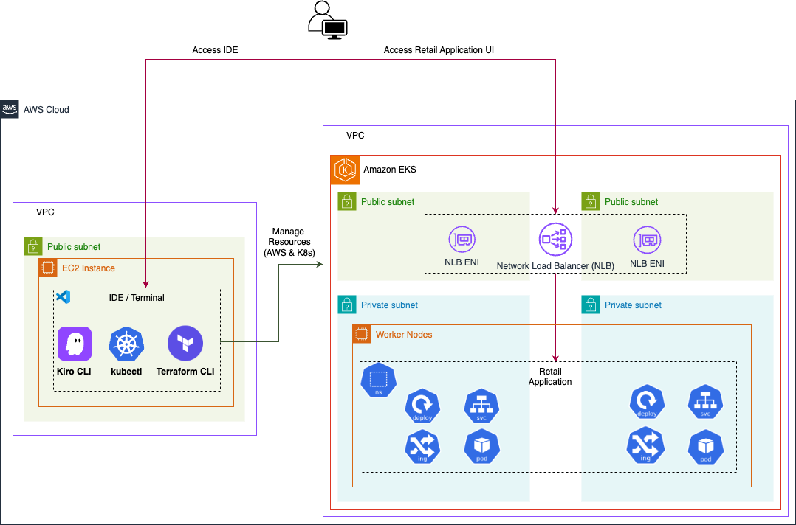
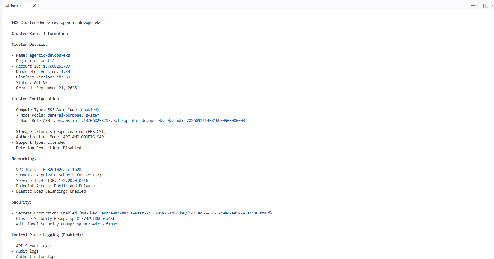
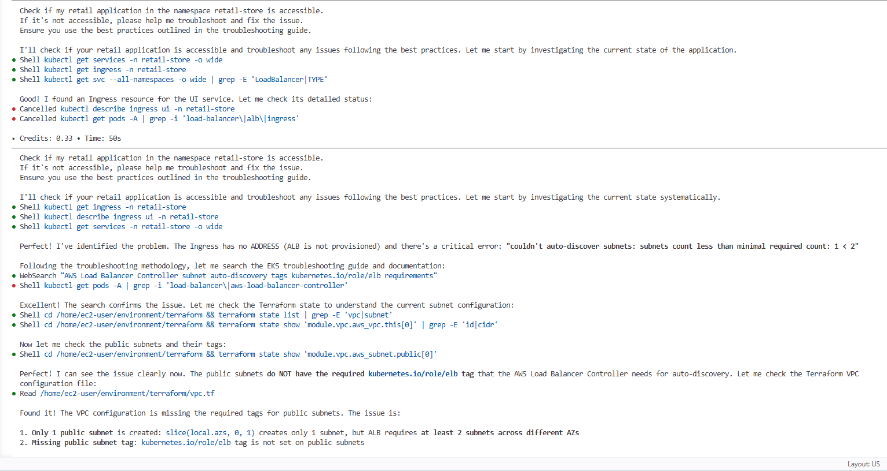

# Agentic Developer Experience with Amazon EKS

I recently joined a workshop to explore how an **agentic developer experience** can be built around Amazon EKS.

The goal was not simply to deploy an application on EKS. Instead, the workshop focused on how developers can combine **AWS-native tools, Kiro CLI, and an EKS MCP server** to interact with and troubleshoot an EKS environment using natural language.

The workshop simulated a platform team responsible for an e-commerce application running on a microservices architecture.

The scenario was simple: customers could not access the application.

Rather than manually checking Kubernetes resources, AWS networking, and Terraform one by one, I gave the problem to the agent and let it investigate the environment.

---

## Understanding the Kiro CLI Agent

Before troubleshooting, I wanted to understand what actually powers the agent.

The workshop provides a custom Kiro CLI agent called `kiro_eks_agent`.

The configuration defines the agent's role, available MCP servers, tools, and additional resources such as steering documents and skills.

<details>

<summary><strong>kiro_eks_agent.json</strong></summary>

```json
{
  "name": "kiro_eks_agent",
  "description": "Kiro custom agent for AWS EKS management and operations",

  "prompt": "You are an AWS EKS expert, you are teaching and helping a user manage their AWS EKS cluster",

  "mcpServers": {
    "eks-mcp-server": {
      "disabled": false,
      "type": "stdio",
      "command": "uvx",
      "args": [
        "mcp-proxy-for-aws@latest",
        "https://eks-mcp.us-west-2.api.aws/mcp",
        "--service",
        "eks-mcp"
      ]
    },

    "aws-knowledge-mcp-server": {
      "url": "https://knowledge-mcp.global.api.aws",
      "type": "http"
    }
  },

  "tools": [
    "@eks-mcp-server",
    "@aws-knowledge-mcp-server",
    "read",
    "write",
    "shell",
    "aws",
    "thinking",
    "introspect"
  ],

  "allowedTools": [
    "read",
    "thinking",
    "introspect"
  ],

  "resources": [
    "file://.kiro/steering/**/*.md",
    "file://terraform/README.md",
    "skill://.kiro/skills/*/SKILL.md"
  ]
}
```
The configuration mainly defines four things:

Prompt — defines the agent's role and behavior.
MCP servers — connect the agent to EKS operations and AWS documentation.
Tools — give it capabilities such as read, shell, aws, and MCP tools, with permissions controlling which actions require approval.
Resources — provide additional context from steering files and skills under .kiro/.

For example:

"resources": [
  "file://.kiro/steering/**/*.md",
  "file://terraform/README.md",
  "skill://.kiro/skills/*/SKILL.md"
]

The important idea is that the agent is not just an AI generating commands. It has a defined role, access to tools, and project-specific troubleshooting guidance.

That became useful when I gave it a real problem: the retail application was not accessible.
</details>

The part I found interesting was the **resources** section.

The agent does not operate only from its base model knowledge. It can also load project-specific guidance from `.kiro/steering/` and skills under `.kiro/skills/`.

For troubleshooting, one of the important steering documents was the troubleshooting methodology. It defined rules such as:

* verify that the problem actually exists before changing anything
* search the EKS troubleshooting documentation
* inspect Terraform state when investigating infrastructure
* run `terraform plan` before applying changes
* recreate the Ingress after changing subnet configuration
* wait for the load balancer and DNS to become ready before testing

This gave the agent a defined process to follow instead of simply generating a random sequence of commands.

---

## Exploring the EKS Cluster

I first asked the agent for a cluster overview:

```text
Provide a comprehensive overview of my EKS cluster including:

- Cluster basic information and configuration
- All namespaces and their purposes
- Node information and capacity
- Installed add-ons and their status
```

The agent returned:

```text
Cluster: agentic-devops-eks
Kubernetes: 1.34
Mode: EKS Auto Mode

Namespaces:
- retail-store
- monitoring
- adot-collector
- kube-system

Compute:
- 1 x c6a.large
- ~79% memory utilization
- 10 pods running
```

I then asked it to analyze the application:

```text
Analyze the application running on my cluster and show the current
health status of all application components with pods associated
with each component.
```

The application looked healthy.

All eight application pods were running with **zero restarts**.

However, customers still could not access the application.

So the next step was to investigate the path from the application to the Internet.

---

## Troubleshooting the Application

I gave the agent the problem directly:

```text
Check if my retail application in the namespace retail-store is accessible.
If it's not accessible, please help me troubleshoot and fix the issue.
Ensure you use the best practices outlined in the troubleshooting guide.
```

The agent started by checking the Services and Ingress.

The first useful output was:

```text
$ kubectl get ingress -n retail-store

NAME   CLASS   HOSTS   ADDRESS   PORTS
ui     alb     *                 80
```

The important part was:

```text
ADDRESS: <none>
```

The Ingress existed, but no load balancer address had been assigned.

The agent then inspected the Ingress details and found the actual error:

```text
Warning  FailedBuildModel

Failed build model due to couldn't auto-discover subnets:
subnets count less than minimal required count: 1 < 2
```

Now there was a concrete signal.

The problem was not the application pods. The failure was happening while the AWS Load Balancer Controller was trying to build the ALB.

### Tracing the Root Cause

Following the troubleshooting guidance, the agent continued from Kubernetes into the infrastructure layer.

It inspected the Terraform state and then read the VPC configuration.

Two problems became clear:

```text
1. Only one public subnet was being created.
2. The public subnet was missing:
   kubernetes.io/role/elb
```

The original Terraform configuration created public subnets from only one AZ:

```hcl
public_subnets = [
  for k, v in slice(local.azs, 0, 1) :
  cidrsubnet(local.vpc_cidr, 8, k + 48)
]
```

The agent changed it to create public subnets across the configured AZs:

```hcl
public_subnets = [
  for k, v in local.azs :
  cidrsubnet(local.vpc_cidr, 8, k + 48)
]

public_subnet_tags = {
  "kubernetes.io/role/elb" = 1
}
```

The next step was important: it did not immediately apply the change.

It first ran:

```text
terraform plan
```

The plan showed the expected changes:

```text
+ create second public subnet
~ update existing public subnet tags

No destroy operations
```

Only after validating the plan did the agent apply it:

```text
terraform apply tfplan
```

The VPC now had public subnets in:

```text
us-west-2a
us-west-2b
```

The agent then recreated the Ingress so the load balancer controller could reconcile it using the corrected subnet configuration.

This time, the Ingress received an address:

```text
k8s-retailst-ui-f5f1e8cd51-1530366816.us-west-2.elb.amazonaws.com
```

The agent checked the ALB directly and confirmed that it had been created across both Availability Zones.

After the ALB became active, it waited for DNS propagation before testing the endpoint.

Finally:

```text
HTTP Status: 200
Total Time: ~7ms
```

And the target group was healthy:

```text
TargetHealth:
State: healthy
```

The application was accessible again.

---

## What the Agent Actually Did

What impressed me was not that the agent could execute `kubectl`.

The interesting part was the investigation path:

```text
Application inaccessible
        ↓
Ingress has no ADDRESS
        ↓
Ingress reports subnet discovery error
        ↓
Check EKS / ALB requirements
        ↓
Inspect Terraform state
        ↓
Find missing subnet + missing tag
        ↓
Update Terraform
        ↓
terraform plan
        ↓
terraform apply
        ↓
Recreate Ingress
        ↓
Wait for ALB/DNS
        ↓
curl → HTTP 200
        ↓
Target health → healthy
```

The agent moved between several layers of the stack:

**Kubernetes → AWS Load Balancer → VPC/Subnets → Terraform → Application**

That is what makes this different from simply asking an AI:

> "What command should I use to troubleshoot an EKS Ingress?"

The agent had both **context and tools**.

The steering documents provided the methodology, the MCP integrations provided access to AWS/EKS information, and the shell/read/write tools allowed it to inspect and modify the environment.

The result was a workflow closer to an engineer's investigation:

**observe → form a hypothesis → collect evidence → change the correct layer → validate → verify the final result**

For me, that was the most interesting part of the workshop. The value of an agent in platform engineering is not just generating commands. It is being able to connect information across the stack and carry a troubleshooting task from the initial symptom to a verified fix.
