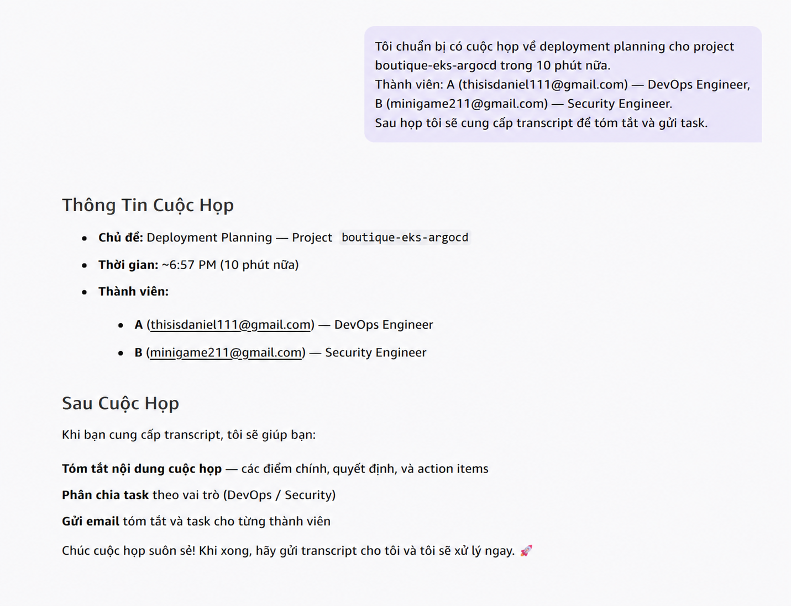
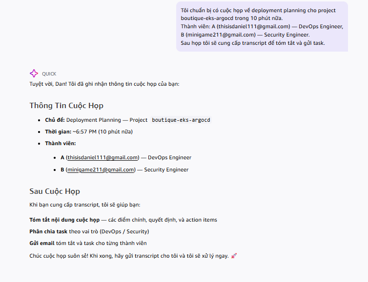
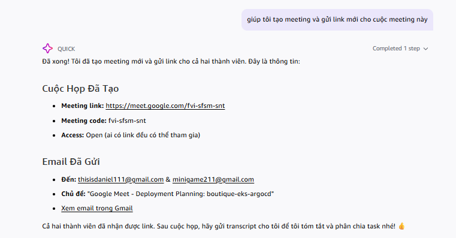
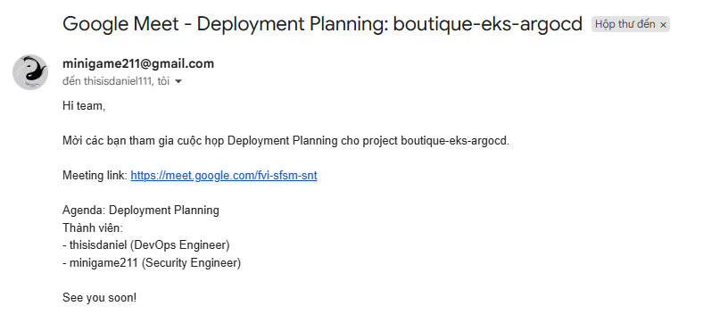
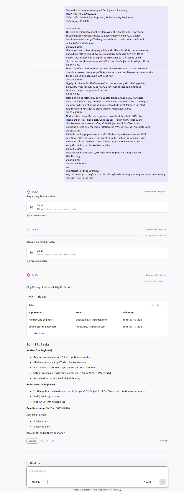
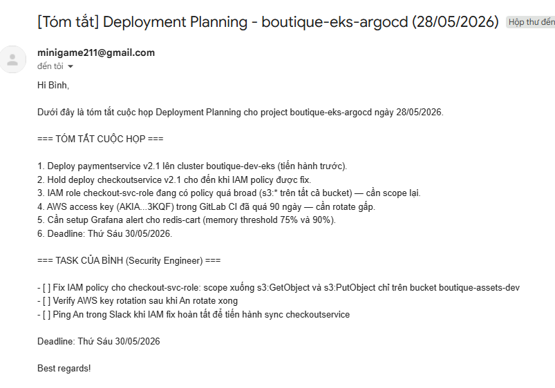
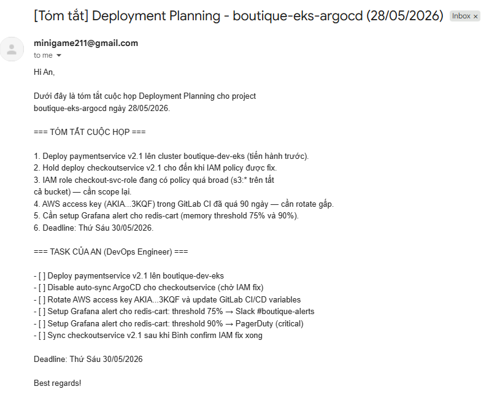

## Amazon Quick là gì?

Amazon Quick là AI assistant trong Amazon Quick Suite, được AWS xây dựng để hỗ trợ các công việc hằng ngày như chuẩn bị meeting, follow-up, quản lý action items và làm việc với email hoặc calendar.

Điểm khác với chatbot thông thường là Quick không chỉ trả lời bằng text. Nó có thể kết nối với Gmail, Google Meet, Calendar hoặc Slack để thực hiện hành động thật sau khi người dùng duyệt.

Trong demo này mình thử dùng Quick như một trợ lí meeting cho team DevOps.



## Demo: dùng Amazon Quick để tóm tắt cuộc họp và gửi task follow-up

Bối cảnh là một buổi deployment planning cho project `boutique-eks-argocd`.

Team gồm:

- An: DevOps Engineer
- Bình: Security Engineer

Mục tiêu của buổi họp:

- Deploy `paymentservice`
- Kiểm tra IAM policy của `checkoutservice`
- Rotate AWS access key trong GitLab CI
- Setup monitoring alert cho Redis

Điều mình muốn test là: sau cuộc họp, liệu Quick có thể tự đọc transcript, hiểu ai làm gì và gửi follow-up đúng người hay không?

## 1. Chuẩn bị context trước cuộc họp

Trước giờ họp, mình nhắn Quick một đoạn ngắn:

- Chủ đề cuộc họp
- Project name
- Thành viên tham gia
- Vai trò của từng người

Mình cũng nói rằng sau cuộc họp mình sẽ gửi transcript để Quick xử lý.



Quick phản hồi lại bằng một meeting brief khá gọn:

- Chủ đề meeting
- Thời gian
- Danh sách thành viên
- Những việc nó sẽ làm sau cuộc họp

Đây là bước khá quan trọng vì Quick đã có sẵn context về role của từng người trước khi transcript xuất hiện.

## 2. Tạo Google Meet và gửi email invite

Sau đó mình yêu cầu Quick tạo Google Meet cho team.

Quick tự:

- Tạo meeting
- Lấy Google Meet link
- Gửi email invite qua Gmail



Email invite được gửi qua Gmail, có link Google Meet và agenda cho buổi deployment planning.



## 3. Sau cuộc họp: đưa transcript cho Quick xử lý

Sau khi họp xong, mình paste transcript vào Quick.

Nội dung cuộc họp xoay quanh:

- Deploy `paymentservice` v2.1
- Hold `checkoutservice`
- Fix IAM policy quá broad
- Rotate AWS access key đã quá 90 ngày
- Setup Grafana alert cho Redis

Ví dụ transcript:

```text
An: Mình deploy paymentservice trước.

Bình: checkoutservice đang dùng IAM policy quá rộng,
cần scope lại chỉ cho bucket boutique-assets-dev.

An: OK, mình sẽ hold auto-sync checkoutservice.

Bình: AWS access key trong GitLab CI đã quá 90 ngày,
cần rotate gấp.

An: Mình rotate key và setup Grafana alert cho redis-cart.
```

Sau đó mình yêu cầu:

```text
Hãy tóm tắt cuộc họp và gửi task follow-up cho từng người.
```

Quick sẽ:

- Đọc transcript
- Tóm tắt nội dung chính
- Tách task theo từng người
- Chuẩn bị gửi email qua Gmail



Quick không tự gửi ngay.

Nó hiển thị action review cho Gmail `SendEmail`, nghĩa là người dùng vẫn kiểm soát được email trước khi AI thực hiện hành động.

Với các nội dung liên quan IAM hoặc CI/CD secret, bước này khá cần thiết.

## 4. Email follow-up cho Bình (Security Engineer)

Quick gửi cho Bình một email riêng chỉ chứa task Security.



Các task của Bình gồm:

- Fix IAM policy cho `checkout-svc-role`
- Scope S3 permission xuống đúng bucket
- Verify AWS key rotation
- Ping An sau khi IAM fix xong

Điểm hay là Bình không phải đọc toàn bộ checklist DevOps của An.

## 5. Email follow-up cho An (DevOps Engineer)

Email của An chứa các task DevOps.



Ví dụ:

- Deploy `paymentservice`
- Disable auto-sync ArgoCD
- Rotate AWS access key
- Update GitLab CI/CD variables
- Setup Grafana alert
- Sync `checkoutservice` sau khi IAM fix xong

Quick vẫn giữ được dependency giữa các task, ví dụ:

```text
checkoutservice chỉ được sync lại sau khi IAM policy đã fix xong.
```
