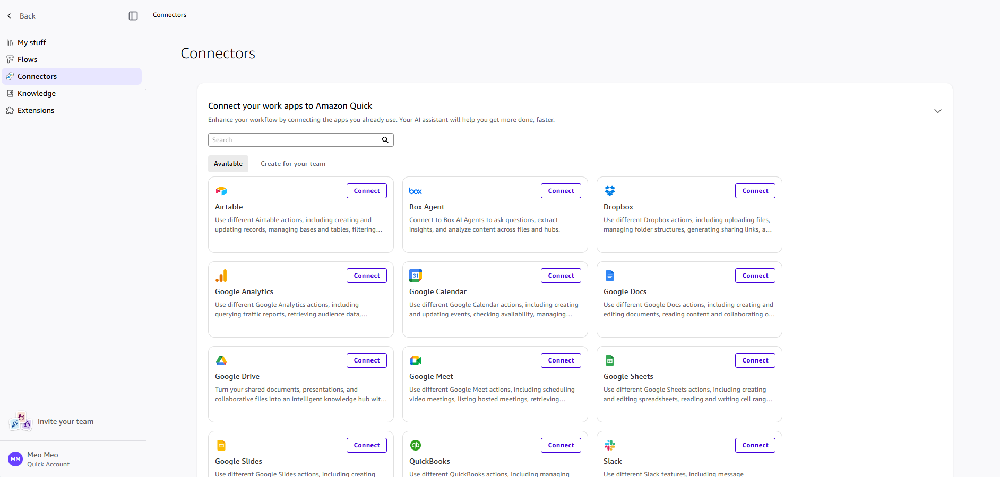
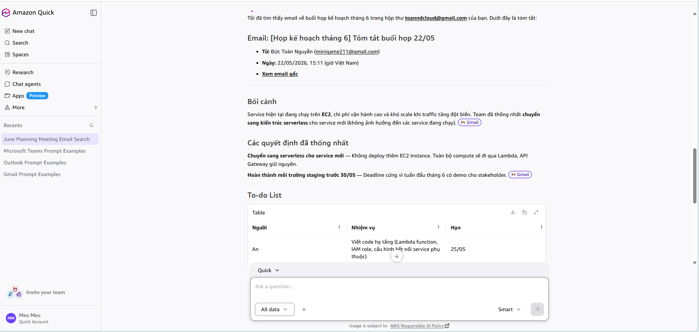
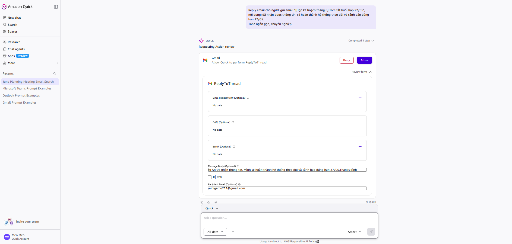

Chatbot trả lời. AI agent bắt đầu hành động trong IDE, browser, terminal. Nhưng dữ liệu công việc vẫn nằm ở Outlook, Teams, file trên máy — và bạn vẫn phải tự mang nó đến cho AI. Desktop AI agent đưa AI xuống thẳng máy người dùng để truy cập trực tiếp dữ liệu đó.

Amazon Quick là một ví dụ.

---

## Amazon Quick là gì?

Desktop AI agent của AWS, ra mắt tháng 4/2026. Bốn điểm chính:

- Kết nối Outlook, Teams, Gmail, Slack, OneDrive
- Đọc file local, email, calendar, chat log
- Build context công việc và nhớ qua các session
- Thực hiện action: tóm tắt, draft mail, gửi, post message

Chạy local trên máy. Không cần AWS account — đăng nhập bằng Google, Apple, Amazon, hoặc GitHub là dùng được.

---

## Cách hoạt động

Quick chạy liên tục trong nền và index mọi thứ đã kết nối — email, file, lịch họp, chat — thành một bản đồ context công việc: ai làm gì, dự án nào liên quan đến ai, quyết định nào đưa ra ở đâu. Dữ liệu này được giữ lại qua các lần dùng, nên lần sau hỏi "tuần trước họp quyết định gì?" nó tự tìm lại thay vì bạn phải nhớ.

Tính năng đáng chú ý nhất là proactive mode. Trước cuộc họp 2h chiều, Quick có thể tự kéo:

- Slack thread liên quan
- Tài liệu vừa được chỉnh sửa
- Email trao đổi gần nhất về chủ đề đó

Không cần bạn hỏi trước.

Toàn bộ xử lý diễn ra local tại `~/.quickwork/` — tài liệu nội bộ, runbook, email nội bộ có thể đưa cho nó xử lý mà không lo data leak.

---

## Khi nào nên dùng?

Phù hợp khi bạn:

- Làm việc nhiều với email và họp hành
- Dùng Microsoft 365 hoặc Google Workspace
- Cần tổng hợp thông tin từ nhiều nguồn (email + file + Teams)
- DevOps/SRE cần tóm tắt incident từ log, ticket, Slack

Ít phù hợp hơn nếu:

- Dữ liệu nhạy cảm và tổ chức chưa approve tool bên thứ ba
- Workflow chủ yếu là code, không phải email/chat

---

## Demo: tóm tắt email họp và gửi follow-up

Tình huống phổ biến: vừa kết thúc một buổi họp, cần gửi email tóm tắt và to-do list cho cả team.

**Setup một lần:** Settings → Capabilities → Connections → Authenticate Outlook. Xong.



**Prompt:**

```
Tìm email về buổi họp kế hoạch tháng 6 hôm nay, tóm tắt các điểm chính và to-do list.
```

**Output:**

```
Họp kế hoạch tháng 6 - 22/05/2026

- Chuyển sang kiến trúc serverless cho service mới
- Hoàn thành môi trường staging trước 30/05

To-do:
An → Viết code hạ tầng cho service mới (hạn 25/05)
Bình → Cài đặt hệ thống theo dõi và cảnh báo (hạn 27/05)
Cường → Kiểm tra phân quyền truy cập (hạn 24/05)
```



Tiếp tục trong cùng conversation:

```
Draft email gửi cho tất cả người tham gia,
subject: "[Họp tháng 6] Tóm tắt và to-do - 22/05"
```



Quick soạn draft, hiển thị preview để review, confirm thì gửi thẳng qua Outlook.

Flow tương tự áp dụng được cho Teams — đọc chat log, tóm tắt thread, gửi summary vào channel. Kết hợp thêm OneDrive thì chỉ cần một prompt duy nhất cho cả ba nguồn.

---

Amazon Quick không thay thế ChatGPT cho câu hỏi nhanh hay brainstorming. Nhưng với công việc liên quan đến email, file và meeting — nơi dữ liệu nằm rải rác ở nhiều nơi — mô hình local-first của nó giải quyết được điểm nghẽn mà chatbot web không làm được.
