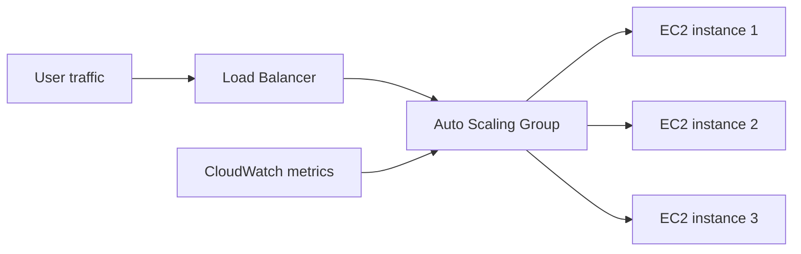

Có những lúc một website thương mại điện tử vẫn chạy mượt giữa flash sale, trong khi một server đơn lẻ xử lý cùng lượng truy cập đó lại bắt đầu timeout và treo hẳn. Khác biệt không nằm ở việc máy nào “mạnh” hơn, mà nằm ở cách hạ tầng **tự co giãn** theo nhu cầu.

Trên AWS, câu chuyện này thường xoay quanh **Auto Scaling Group (ASG)** và **Horizontal Scaling**: thay vì cố nhét thêm tài nguyên vào một máy, hệ thống sẽ tăng hoặc giảm số lượng EC2 instance đang phục vụ phía sau Load Balancer.

## Vì sao hệ thống cần co giãn?

Nếu một cụm EC2 được thiết kế để phục vụ 100 người dùng đồng thời nhưng lưu lượng bất ngờ tăng lên 1.000 người, CPU sẽ chạm ngưỡng, request bắt đầu timeout, rồi lỗi lan rộng sang người dùng. Ngược lại, nếu lúc nào cũng giữ sẵn 10 instance để phòng hờ trong khi phần lớn thời gian chỉ có vài chục request, bạn đang đốt tiền cho những máy ngồi không.

Auto Scaling được tạo ra để giải bài toán đó: giữ năng lực xử lý vừa đủ cho tải hiện tại, nhưng vẫn có thể mở rộng nhanh khi cần.



## Vertical Scaling và Horizontal Scaling

### Vertical Scaling

Vertical Scaling là thay đổi cấu hình của chính một instance đang chạy. Ví dụ, bạn dừng một con `t3.medium` rồi đổi sang `m5.2xlarge` để có thêm CPU và RAM.

Cách này đơn giản, nhưng có hai giới hạn rõ ràng:

- Mỗi loại instance đều có trần tài nguyên.
- Việc nâng cấp thường đòi hỏi dừng máy, nên khó phù hợp với hệ thống cần high availability.

Nếu chỉ có một instance duy nhất, nó chết là cả hệ thống chết. Với ứng dụng production, đó là điểm yếu quá lớn.

### Horizontal Scaling

Horizontal Scaling không thay đổi từng instance, mà thay đổi **số lượng instance** chạy song song. Mỗi instance chạy cùng ứng dụng, còn Load Balancer sẽ phân phối traffic đến các instance khỏe mạnh.

Khi tải tăng, ASG sẽ launch thêm instance, gọi là **scale-out**. Khi tải giảm, ASG terminate bớt instance dư, gọi là **scale-in**.

Điểm quan trọng là hệ thống vẫn sống tốt nếu một instance gặp sự cố, vì Load Balancer sẽ ngừng gửi traffic đến instance đó và chuyển sang các instance còn lại.

## Bên trong một lần scaling

ASG không chỉ “bấm launch” hoặc “bấm terminate” một cách thô bạo. Nó có một quy trình để đảm bảo instance mới thật sự sẵn sàng trước khi nhận traffic, và instance cũ rút lui an toàn trước khi biến mất.

### Health Check

Một instance vừa được tạo chưa thể coi là sẵn sàng ngay. ASG và Load Balancer thường kiểm tra qua nhiều lớp:

- **EC2 status check**: xác nhận instance đã boot thành công và network hoạt động bình thường.
- **ELB health check**: Load Balancer gọi endpoint như `/health` để kiểm tra ứng dụng có trả về `200 OK` hay không.
- **Custom health check**: ứng dụng có thể tự báo trạng thái nếu cần logic phức tạp hơn.

Nếu instance vượt qua health check, nó được đưa vào trạng thái **InService** và bắt đầu nhận traffic. Nếu liên tục fail, ASG coi đó là instance lỗi và launch instance thay thế.

### Lifecycle Hook

Lifecycle Hook cho phép “giữ lại” instance ở hai thời điểm quan trọng:

- **Launching**: instance đã được tạo nhưng chưa vào InService. Đây là lúc cài agent monitoring, lấy config từ Parameter Store, warm up cache, hoặc chuẩn bị môi trường runtime.
- **Terminating**: instance đã được chọn để xóa nhưng chưa bị terminate ngay. Đây là cơ hội để graceful shutdown, ngắt khỏi Load Balancer, chờ request đang chạy xong, rồi đóng kết nối an toàn.

Nếu không có hook terminate, instance có thể bị xóa ngay khi vẫn còn request dang dở, dẫn tới lỗi 5xx hoặc mất giao dịch.

### Timeout

Mỗi hook đều có một **heartbeat timeout**. Nếu script xử lý không gửi tín hiệu hoàn tất đúng hạn, ASG sẽ tiếp tục quy trình mặc định.

Điều này rất cần thiết để tránh trường hợp một script bị treo làm kẹt cả quá trình scaling. Timeout phải đủ dài để công việc hoàn tất, nhưng không được dài đến mức làm hệ thống phản ứng chậm.

## ASG quyết định scale như thế nào?

Câu hỏi quan trọng không phải là instance được chuẩn bị ra sao, mà là: **khi nào ASG quyết định thêm hoặc bớt instance, và thêm bao nhiêu?**

AWS cung cấp bốn kiểu scaling policy chính.

### Simple Scaling

Simple Scaling là kiểu cơ bản nhất. Bạn tạo một CloudWatch Alarm, ví dụ CPU trung bình vượt 70%, và gắn với một hành động cố định như thêm 2 instance.

Sau khi action chạy xong, ASG bước vào **cooldown period**. Trong khoảng này, các alarm tiếp theo bị bỏ qua hoàn toàn, dù tải có tăng tiếp.

Cách này dễ hiểu, nhưng phản ứng chậm. Nếu traffic tăng mạnh ngay sau khi scale-out, hệ thống vẫn phải chờ cooldown kết thúc mới có thể scale tiếp.

### Step Scaling

Step Scaling linh hoạt hơn. Thay vì chỉ có một ngưỡng và một action, bạn định nghĩa nhiều mức phản ứng theo độ lệch so với ngưỡng.

Ví dụ:

- CPU vượt 50% đến 60%: thêm 1 instance
- CPU vượt 60% đến 80%: thêm 2 instance
- CPU vượt 80%: thêm 4 instance

Thay vì cooldown cứng, Step Scaling dùng **instance warm-up time**. Instance mới launch chưa được tính đầy đủ vào metric trong một khoảng thời gian nhất định, nhưng ASG vẫn tiếp tục đánh giá alarm.

Đó là điểm hay: nếu tải vẫn tăng, ASG vẫn có thể scale tiếp ngay, không bị khóa cứng như Simple Scaling.

### Scheduled Scaling

Có nhiều lúc traffic tăng giảm rất dễ đoán. Ví dụ giờ hành chính, cuối tuần, hoặc một đợt flash sale đã biết trước thời điểm.

Scheduled Scaling cho phép bạn đặt lịch sẵn:

- 07:55 mỗi sáng tăng capacity để chuẩn bị cho giờ cao điểm
- 18:05 mỗi tối giảm capacity để tiết kiệm chi phí
- Trước 30 phút của một sự kiện lớn, tăng minimum capacity lên mức mong muốn

Cách này đặc biệt hữu ích khi bạn **biết trước** traffic sẽ tăng, thay vì chờ hệ thống tự phát hiện rồi mới phản ứng.

### Target Tracking Scaling

Đây là kiểu dễ dùng nhất và thường là lựa chọn mặc định cho ứng dụng web. Bạn chỉ cần đặt một mục tiêu, ví dụ giữ **CPU trung bình ở mức 50%**, còn ASG tự tính cần thêm hay bớt bao nhiêu instance.

Khi metric vượt mục tiêu, ASG scale-out. Khi metric giảm thấp, ASG scale-in. Bạn không phải tự định nghĩa nhiều step, cũng không phải tính toán mức tăng giảm thủ công.

Target Tracking còn hỗ trợ nhiều metric khác ngoài CPU, chẳng hạn:

- Network In/Out
- Request Count Per Target với Application Load Balancer
- Custom metric do ứng dụng đẩy lên CloudWatch

## Kết hợp chính sách trong thực tế

Bốn cơ chế này không loại trừ nhau. Trong production, người ta thường kết hợp để vừa phản ứng tốt với tải bất ngờ, vừa chủ động cho những sự kiện có thể dự đoán.

```text
Target Tracking  → xử lý dao động bình thường mỗi ngày
Scheduled Scaling → chuẩn bị trước cho flash sale hoặc batch job lớn
```

Ví dụ, một hệ thống thương mại điện tử có thể dùng Target Tracking để giữ CPU quanh 50% trong ngày thường. Đồng thời, trước một chiến dịch sale lớn, đội vận hành đặt Scheduled Scaling để tăng minimum capacity từ trước 30 phút. Nhờ đó, hạ tầng không phải đợi metric tăng lên rồi mới mở rộng.

## Mẫu luồng scale-out

Một lần scale-out thường diễn ra theo thứ tự sau:

1. ASG thấy Desired Capacity cần tăng.
2. ASG launch instance từ Launch Template.
3. Hook launching chạy các bước chuẩn bị.
4. Instance vượt health check.
5. Instance chuyển sang InService và bắt đầu nhận traffic.

Nếu instance fail health check, ASG terminate nó và tạo instance mới thay thế.

## Khi nào dùng kiểu nào?

Không có một policy nào đúng cho mọi trường hợp.

- Nếu ứng dụng có traffic khó đoán, Target Tracking thường là lựa chọn tốt nhất.
- Nếu traffic tăng theo nhiều mức khác nhau, Step Scaling phản ứng sát thực tế hơn.
- Nếu bạn biết trước thời điểm tải tăng, Scheduled Scaling giúp chủ động và ổn định hơn.
- Nếu muốn cấu hình đơn giản, Simple Scaling vẫn dùng được, nhưng nên hiểu rõ hạn chế cooldown của nó.

## Tổng kết

Auto Scaling không chỉ là “thêm máy khi đông”. Nó là cơ chế điều phối để hệ thống luôn có đủ năng lực xử lý, nhưng không dư thừa quá nhiều tài nguyên trong lúc nhàn rỗi.

Horizontal Scaling là nền tảng để đạt high availability và elastic capacity trên AWS. Khi kết hợp đúng giữa EC2, Load Balancer, CloudWatch, health check và scaling policy, ASG có thể tự động xử lý phần lớn biến động tải mà không cần con người can thiệp liên tục.

Nếu bạn đang thiết kế một hệ thống cần vừa ổn định vừa tối ưu chi phí, đây là một trong những cơ chế nên hiểu thật kỹ ngay từ đầu.
