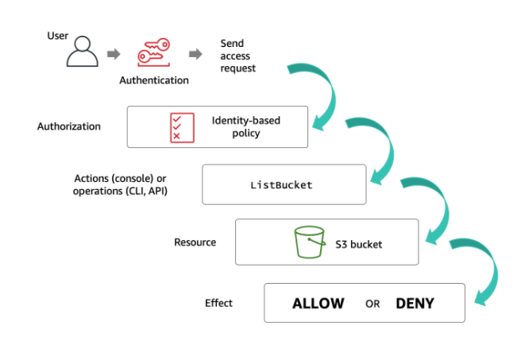
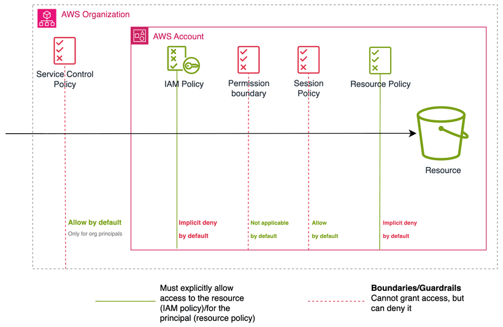

Ở bài trước, mình đã đi qua **IAM Identity**: user, group và role. Identity trả lời câu hỏi *ai đang gọi AWS*. Nhưng để biết request đó được phép hay bị chặn, AWS cần đọc **policy**.

**IAM Policy** là tài liệu JSON mô tả một principal được **allow** hoặc **deny** các API action nào, trên resource nào, trong điều kiện nào.

Bốn thành phần cốt lõi của một policy statement:

- **Effect**: `Allow` hoặc `Deny`
- **Action**: API action như `s3:ListBucket`, `dynamodb:PutItem`
- **Resource**: ARN của resource cụ thể
- **Condition**: điều kiện bổ sung như region, source IP, MFA, tag

Ví dụ một statement cho phép list S3 bucket:

```json
{
  "Effect": "Allow",
  "Action": "s3:ListBucket",
  "Resource": "arn:aws:s3:::my-app-bucket"
}
```

DOP-C02 thường hỏi ở phần **policy evaluation**: policy nào tự cấp quyền, policy nào chỉ giới hạn, **explicit deny** thắng ra sao, và **cross-account** access cần lớp policy nào.



---

## 5 loại policy cần nắm

Trong phạm vi IAM nền tảng, có 5 loại policy thường gặp nhất:

1. **Identity-based policy** — identity này được làm gì?
2. **Resource-based policy** — resource này cho ai vào?
3. **Permissions boundary** — identity này được phép tối đa tới đâu?
4. **AWS Organizations SCP** — account hoặc OU này được phép tối đa tới đâu?
5. **Session policy** — phiên assume role này được phép tối đa tới đâu?

Hai loại đầu có thể **cấp quyền**. Ba loại sau là **guardrail**: không tự cấp quyền, chỉ giới hạn quyền tối đa mà các policy khác có thể cấp.

---

## 1. Identity-based policy

**Identity-based policy** được attach vào IAM identity: user, group hoặc role.

Nó trả lời câu hỏi: **identity này được phép gọi action gì, trên resource nào?**

```json
{
  "Effect": "Allow",
  "Action": "s3:GetObject",
  "Resource": "arn:aws:s3:::my-app-bucket/*"
}
```

Có hai dạng chính:

- **Managed policy**: tồn tại độc lập, có ARN riêng, attach được vào nhiều identity, xóa identity không mất policy.
- **Inline policy**: gắn chết vào một identity duy nhất, xóa identity thì policy biến mất theo.

Trong thực tế, **customer managed policy** dễ audit hơn inline policy khi nhiều role cần permission giống nhau.

---

## 2. Resource-based policy

**Resource-based policy** được attach trực tiếp vào resource, không phải identity.

Nó trả lời câu hỏi: **ai được phép truy cập resource này?**

Các service phổ biến hỗ trợ resource-based policy: S3, SQS, SNS, KMS, Lambda, EventBridge, Secrets Manager.

```json
{
  "Effect": "Allow",
  "Principal": {
    "AWS": "arn:aws:iam::222222222222:role/AppReadRole"
  },
  "Action": "s3:GetObject",
  "Resource": "arn:aws:s3:::shared-artifacts/*"
}
```

Điểm khác biệt quan trọng:

- **Identity-based policy**: tôi được làm gì với resource khác?
- **Resource-based policy**: ai được làm gì với tôi?

Với **cross-account** access, resource-based policy rất quan trọng vì nó có thể allow principal từ account khác mà không cần assume role trong account chứa resource.

---

## 3. Permissions boundary

**Permissions boundary** gắn vào IAM user hoặc role để đặt **trần quyền tối đa**.

Nó không tự cấp quyền. Nó chỉ giới hạn quyền mà identity-based policy có thể cấp.

```json
{
  "Effect": "Allow",
  "Action": ["s3:*", "dynamodb:*"],
  "Resource": "*"
}
```

Nếu role có identity-based policy allow `ec2:*`, nhưng boundary chỉ allow S3 và DynamoDB, role vẫn không dùng được EC2.

> **Mental model**: Effective permission = Identity-based Allow ∩ Permissions Boundary

Use case điển hình: delegate quyền tạo role cho developer, nhưng buộc role mới phải gắn boundary để không vượt quá quyền nhất định.

---

## 4. AWS Organizations SCP

**Service Control Policy** là policy ở tầng AWS Organizations, áp vào account hoặc OU.

SCP cũng không tự cấp quyền. Nó đặt trần quyền tối đa cho toàn bộ account, kể cả root user của member account.

Ví dụ SCP chặn mọi request ngoài region Singapore:

```json
{
  "Effect": "Deny",
  "Action": "*",
  "Resource": "*",
  "Condition": {
    "StringNotEquals": {
      "aws:RequestedRegion": "ap-southeast-1"
    }
  }
}
```

Với DOP-C02, các keyword sau thường gợi ý SCP:

```text
multi-account guardrail
block region hoặc service cho toàn organization
prevent disabling CloudTrail
deny leaving organization
```

---

## 5. Session policy

**Session policy** được truyền vào lúc gọi STS `AssumeRole`, giới hạn quyền của một session tạm thời.

```text
User assume AdminRole,
nhưng lần này truyền session policy chỉ cho phép đọc S3.
→ Dù role gốc có quyền rộng hơn, session chỉ hoạt động trong phạm vi S3.
```

> **Mental model**: Effective session permission = Role permission ∩ Session policy

Session policy thường dùng trong automation hoặc federation flow khi cần cấp quyền tạm thời hẹp hơn quyền thật của role.

---

## Ví dụ thực tế: Lambda đọc S3 cross-account

Bài toán:

```text
Lambda ở Account A cần đọc object trong S3 bucket ở Account B.
```

Lambda execution role ở Account A:

```text
arn:aws:iam::111111111111:role/lambda-read-artifacts-role
```

Để request `s3:GetObject` thành công, cần đủ tất cả các lớp:

1. **SCP ở Account A** không được deny `s3:GetObject`
2. **Identity-based policy** trên execution role phải allow `s3:GetObject`
3. **Permissions boundary** nếu có không được loại bỏ quyền S3
4. **Bucket policy ở Account B** phải allow principal từ Account A

Identity-based policy trên execution role:

```json
{
  "Effect": "Allow",
  "Action": "s3:GetObject",
  "Resource": "arn:aws:s3:::shared-artifacts/*"
}
```

Bucket policy ở Account B:

```json
{
  "Effect": "Allow",
  "Principal": {
    "AWS": "arn:aws:iam::111111111111:role/lambda-read-artifacts-role"
  },
  "Action": "s3:GetObject",
  "Resource": "arn:aws:s3:::shared-artifacts/*"
}
```

Nếu thiếu identity-based allow ở Account A → **implicit deny** từ phía identity. Nếu thiếu bucket policy ở Account B → cross-account request bị chặn dù identity có quyền.

---

## Policy evaluation: cách nhớ đúng

AWS không đánh giá policy theo pipeline cố định. AWS thu thập context của request, đọc tất cả policy áp dụng, rồi tính ra quyết định cuối cùng.

Công thức thực dụng:

```text
Effective permission
= (Identity-based Allow ∪ Resource-based Allow)
  ∩ SCP
  ∩ Permissions Boundary
  ∩ Session Policy
  − Explicit Deny
```

Ví dụ một identity có 2 inline policy:

```json
{ "Effect": "Allow", "Action": "ec2:*", "Resource": "*" }
```

```json
{ "Effect": "Deny", "Action": "ec2:TerminateInstances", "Resource": "*" }
```

| Action | Kết quả | Lý do |
|---|---|---|
| `ec2:StartInstances` | **Allow** | Nằm trong `ec2:*`, không bị deny |
| `ec2:StopInstances` | **Allow** | Nằm trong `ec2:*`, không bị deny |
| `ec2:TerminateInstances` | **Deny** | Explicit deny thắng mọi allow |



---

## So sánh nhanh các loại policy

| Loại policy | Gắn vào đâu | Tự cấp quyền? |
|---|---|---|
| Identity-based managed policy | User, Group, Role | Có |
| Identity-based inline policy | Một identity duy nhất | Có |
| Resource-based policy | Resource như S3, SQS, KMS, Lambda | Có |
| Permissions boundary | IAM user hoặc role | Không |
| SCP | Account hoặc OU trong AWS Organizations | Không |
| Session policy | STS session khi assume role | Không |

---

## Kết luận

IAM Policy dễ bị học thuộc lòng sai. Cách học tốt nhất là luôn hỏi 4 câu:

```text
Ai đang gọi?        → Principal / Identity
Gọi action gì?      → Action
Trên resource nào?  → Resource
Policy nào áp dụng? → Identity, resource, boundary, SCP, session
```

Tóm tắt: hai nguyên tắc cốt lõi cần khắc sâu là **Explicit Deny luôn thắng**, và nếu không có Allow phù hợp thì request bị **implicit deny**. Còn lại, chỉ cần nhớ identity-based và resource-based policy là thứ cấp quyền, ba loại boundary/SCP/session chỉ đặt trần.

Bài tiếp theo sẽ đi sâu vào **IAM Policy Evaluation Logic** với các case cụ thể: same-account, cross-account, role session, explicit deny và condition keys.

Tài liệu AWS nên đọc thêm:

- [Policies and permissions in IAM](https://docs.aws.amazon.com/IAM/latest/UserGuide/access_policies.html)
- [Policy evaluation logic](https://docs.aws.amazon.com/IAM/latest/UserGuide/reference_policies_evaluation-logic.html)
- [Permissions boundaries for IAM entities](https://docs.aws.amazon.com/IAM/latest/UserGuide/access_policies_boundaries.html)
- [Service control policies](https://docs.aws.amazon.com/organizations/latest/userguide/orgs_manage_policies_scps.html)
