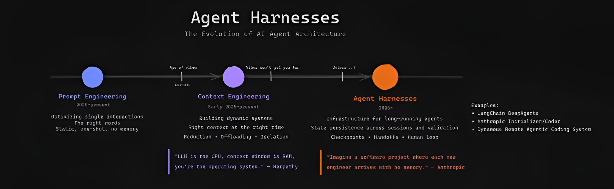
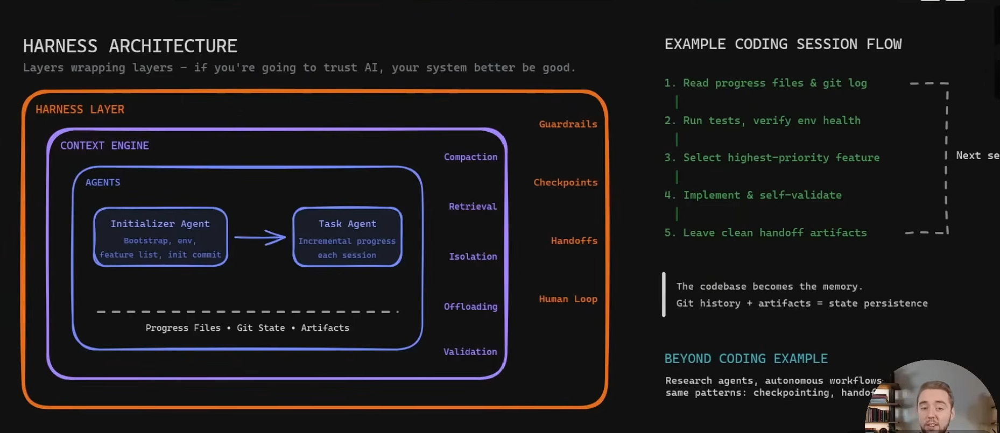

Cre: [Are Agent Harnesses Bringing Back Vibe Coding?](https://www.youtube.com/watch?v=13HP_bSeNjU)

Agent AI ngày càng thông minh hơn. Nhưng thông minh ở từng bước nhỏ không có nghĩa là đáng tin trong workflow dài.

Tôi nhận ra điều này sau khi xem một video về **Agent Harnesses** - và nhận ra mình đã hiểu sai khái niệm này từ đầu. Tôi cứ nghĩ harness chỉ là thứ agent dùng để truyền thông tin cho nhau trong multi-agent workflow. Không sai hoàn toàn - nhưng đó chỉ là một mảnh nhỏ của bức tranh lớn hơn nhiều.

Bài toán thực sự mà harness đang giải quyết lớn hơn thế.

---

## Từ Prompt đến Context đến Harness

Nếu nhìn lại vài năm gần đây, hành trình khá rõ.

Giai đoạn đầu là **Prompt Engineering** (2020 đến nay). Câu hỏi khi đó là: làm sao giao tiếp với AI hiệu quả hơn? Mọi người tập trung vào cách viết prompt, role-playing, few-shot examples, Chain of Thought, format đầu ra. Mục tiêu là cùng một model nhưng trả lời đúng hơn, ổn định hơn. Interaction là tĩnh, one-shot, không có memory.

Sau đó model mạnh dần lên. Vấn đề không còn chỉ là "hỏi thế nào", mà là: AI đang được nhìn thấy những thông tin gì? Đây là giai đoạn **Context Engineering** (đầu 2025 đến nay). RAG, memory, vector database, tool calling, document retrieval - tất cả xoay quanh một điểm: đưa đúng thông tin vào đúng thời điểm. Karpathy có một câu khá hay về giai đoạn này: "LLM is the CPU, context window is RAM, you're the operating system."

Nhưng khi agent bắt đầu làm việc lớn hơn - lập trình, nghiên cứu, migrate hệ thống, tự động hóa workflow nhiều bước - một câu hỏi mới xuất hiện: làm sao để agent hoàn thành công việc kéo dài hàng trăm bước qua nhiều session mà không bị lạc hướng?

Đây là nơi **Agent Harnesses** (2025+) trở nên thú vị. Anthropic mô tả bài toán này như sau: "Imagine a software project where each new engineer arrives with no memory." Harness là thứ giải quyết bài toán đó - không phải bằng cách cho agent thêm memory ma thuật, mà bằng cách xây hệ thống xung quanh nó.



---

## Harness là gì?

Nếu Context Engineering hỏi "AI đang được nhìn thấy gì?", thì Harness Engineering hỏi "Hệ thống xung quanh AI được xây như thế nào?"

Nhìn vào kiến trúc thực tế, một agent harness có ba lớp lồng nhau:

- Lớp trong cùng là **Agents** - Initializer Agent và Task Agent, cùng với các artifact chúng tạo ra: progress files, git state, artifacts.
- Bao quanh đó là **Context Engine** - chịu trách nhiệm compaction, retrieval, offloading: quản lý những gì agent được nhìn thấy tại mỗi bước.
- Ngoài cùng là **Harness Layer** - lớp bao quanh toàn bộ hệ thống: guardrails, checkpoints, handoffs, isolation, human loop, validation.

Ba lớp này không thay thế nhau. Thiếu bất kỳ lớp nào, agent có thể vẫn "thông minh" ở từng bước nhỏ nhưng không đáng tin trong môi trường thực.

Phần còn lại của bài này tôi muốn đi sâu vào harness layer - phần ít được nói đến nhất nhưng theo tôi là quan trọng nhất khi đưa agent vào production.



---

## Các thành phần của Harness Layer

### Guardrails

Guardrails là tập hợp các ràng buộc xác định agent không được làm gì.

Điều này nghe đơn giản nhưng thực tế khá phức tạp. Guardrails không chỉ là blocklist hay filter. Với coding agent, guardrails có thể bao gồm: không được commit thẳng lên main mà không có review, không được xóa data production mà không có approval, không được gọi API tốn kém vượt quá một ngưỡng nhất định trong một session.

Guardrails hoạt động ở cả hai chiều: ngăn agent làm điều sai, và nhắc agent hỏi lại khi gặp tình huống không rõ ràng. Một agent không có guardrails tốt sẽ tự tin đi thẳng vào những quyết định mà đáng lẽ cần con người xác nhận.

### Checkpoints

Checkpoints là các điểm dừng bắt buộc trong workflow, nơi agent xác minh trạng thái trước khi tiếp tục.

Bài toán cốt lõi ở đây là lỗi tích lũy. Giả sử agent thực hiện mỗi bước đúng với xác suất 95% - nghe rất cao. Nhưng với workflow 20 bước:

```text
0.95^20 ≈ 36%
```

Với 100 bước:

```text
0.95^100 ≈ 0.6%
```

Một lỗi nhỏ ở đầu chuỗi có thể làm toàn bộ phần sau đi theo hướng sai mà agent không biết.

Checkpoint giải quyết điều này bằng cách chia workflow dài thành các đoạn ngắn có điểm kiểm tra. Trước khi bước sang phase tiếp theo, agent phải xác nhận: test có pass không? Output có khớp với expectation không? Có assumption nào cần được ghi lại không?

Với coding agent, một checkpoint điển hình trông như sau:

```text
1. Đọc progress files và git log
2. Chạy test suite - verify baseline còn ổn
3. Chọn task ưu tiên cao nhất chưa xong
4. Implement trong phạm vi hẹp
5. Chạy test / lint / build - không được tự tuyên bố xong nếu fail
6. Cập nhật progress file
7. Commit hoặc để lại handoff note rõ ràng
```

Không có checkpoint, agent sẽ tự accumulate lỗi và tự tin đi tiếp.

### Handoffs

Handoffs xử lý việc chuyển giao trạng thái giữa các session hoặc giữa các agent.

Đây là điểm mà nhiều người hay nhầm. Agent không có persistent memory theo nghĩa thực. Session sau không "nhớ" session trước theo cách con người nhớ. Thứ duy nhất nó có là những gì được ghi lại thành artifact: progress files, git history, test results, handoff notes.

Nói cách khác: **the codebase becomes the memory. Git history + artifacts = state persistence.**

Một handoff tốt không chỉ là "đã làm xong A, B, C". Nó cần bao gồm: trạng thái hiện tại là gì, assumption nào đang được giữ, việc gì còn dang dở, và bước tiếp theo nên là gì. Thiếu thông tin này, agent tiếp theo sẽ phải đoán - và đoán sai.

### Isolation

Isolation đảm bảo agent làm việc trong môi trường được kiểm soát, không có side effect ngoài ý muốn ra môi trường bên ngoài.

Trong thực tế, điều này có thể là: chạy agent trong sandbox riêng, giới hạn quyền đọc/ghi file, không cho phép agent tự push lên remote repo, hoặc dùng feature flag để thay đổi không ảnh hưởng production cho đến khi được review.

Isolation đặc biệt quan trọng khi agent có quyền thao tác hệ thống thực - database, cloud infrastructure, external API. Một agent không được isolate đúng cách có thể gây ra thay đổi không thể rollback.

### Human Loop

Human loop là cơ chế đưa con người vào những điểm quyết định quan trọng trong workflow.

Điều này không có nghĩa là con người phải approve từng bước nhỏ - điều đó sẽ phá hủy toàn bộ giá trị của automation. Human loop nên được thiết kế có chủ đích: agent tự xử lý những việc rõ ràng và có độ rủi ro thấp, nhưng dừng lại và hỏi con người khi gặp ambiguity cao, rủi ro lớn, hoặc khi kết quả vượt ra ngoài những gì đã được định nghĩa trước.

Một ví dụ: agent đang migrate database schema. Các bước thêm column mới thì tự động. Nhưng bước xóa column cũ - agent dừng lại, tóm tắt impact, và chờ human approval trước khi tiếp tục.

### Validation

Validation là lớp xác minh output của agent trước khi kết quả được dùng hoặc chuyển sang bước tiếp theo.

Validation khác với test thông thường ở chỗ nó không chỉ kiểm tra "code có chạy không" mà còn kiểm tra "agent có làm đúng việc được yêu cầu không". Với coding agent, validation có thể gồm: unit test, integration test, output diff với expectation, semantic check trên generated code.

Điểm quan trọng: agent không được tự tuyên bố hoàn thành khi validation fail. Đây là lỗi phổ biến nhất khi dùng agent không có harness - agent hoàn thành về mặt kỹ thuật nhưng output sai, và không ai biết cho đến khi quá muộn.

---

## Tương lai không chỉ nằm ở model

Điểm khiến tôi thấy Harness Engineering đáng chú ý là nó kéo cuộc nói chuyện về agent ra khỏi câu hỏi "model nào thông minh hơn?".

Model mạnh hơn chắc chắn vẫn quan trọng. Prompt tốt vẫn quan trọng. Context đúng vẫn quan trọng. Nhưng tất cả những thứ đó chủ yếu giúp agent làm tốt từng bước riêng lẻ.

Khi công việc kéo dài qua nhiều file, nhiều tool, nhiều lần chạy test, nhiều session và nhiều quyết định nhỏ, câu hỏi không còn là agent có thể làm được một bước hay không. Câu hỏi là: sau 50 bước, hệ thống có còn biết mình đang ở đâu không?

Với tôi, đây là phần thú vị nhất. AI Agent sẽ không chỉ tiến hóa bằng cách có bộ não tốt hơn, mà còn bằng cách có môi trường làm việc tốt hơn: có trạng thái rõ ràng, có checkpoint, có validation, có handoff, có giới hạn quyền, và có con người xuất hiện đúng lúc.

Nếu Prompt Engineering là cách nói chuyện với AI, Context Engineering là cách cho AI nhìn đúng thứ cần nhìn, thì Harness Engineering là cách biến AI từ một người trả lời thông minh thành một worker có thể tham gia vào workflow thật.
