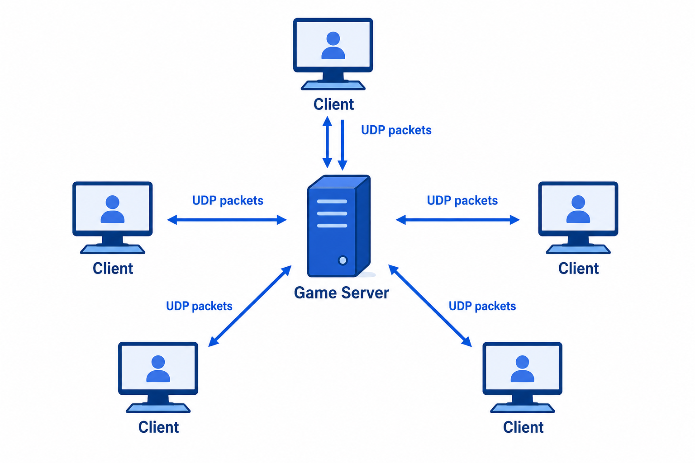
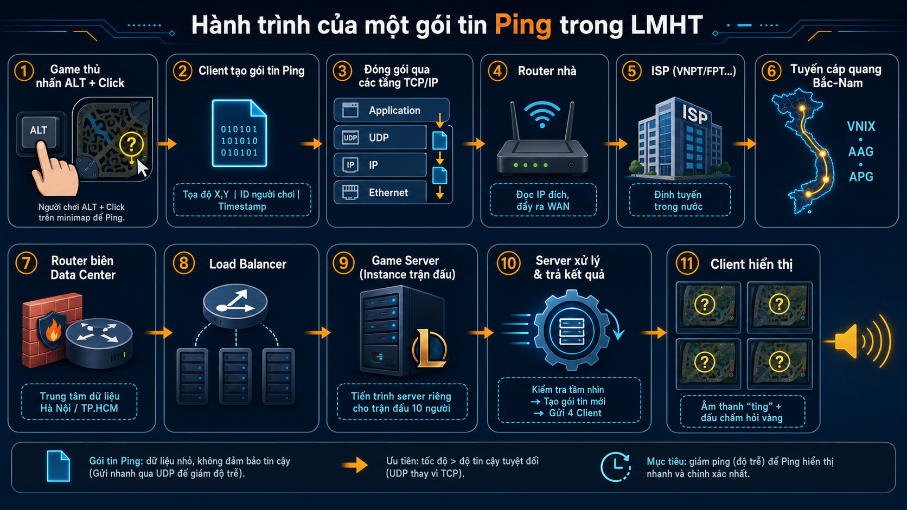

Con Yasuo đi mid của bạn vừa bị Lee Sin team địch gank. Tay trái giữ ALT, tay phải chỉ thẳng vào mặt con gà rừng trên minimap. Âm thanh "hỏi chấm" dồn dập vang lên. Nhưng bạn có bao giờ tự hỏi: từ lúc bạn bấm ping, đến khi 4 người còn lại trong team nghe thấy và nhìn thấy dấu chấm hỏi trên bản đồ, chuyện gì đã thực sự xảy ra? Sự thật là cú ping đó không hề bay thẳng sang máy tính của ông rừng. Nó là một gói tin mạng bé nhỏ vừa được phóng lên hành trình xuyên qua các tuyến cáp quang trong nước, qua vô số router của nhà mạng, chỉ để gửi một thông điệp: "Jung gap".

## 1. Mô hình Client-Server: mọi thao tác đều là lệnh gửi lên server

LOL tổ chức theo kiến trúc Client‑Server. Tất cả người chơi (Client) chỉ kết nối đến một máy chủ trung tâm (Server) của Riot. Server này nắm giữ toàn bộ sự thật của trận đấu: máu, vị trí, thời gian hồi chiêu và cả những cú ping. Client của bạn chỉ là màn hình tương tác: nó gửi thao tác lên server và nhận kết quả từ server để hiển thị, không có quyền tự quyết định bất cứ điều gì – kể cả hiển thị dấu ping lên màn hình đồng đội.

_Client chỉ gửi input và nhận kết quả hiển thị. Server mới là nơi giữ trạng thái thật của trận đấu._

## 2. Bên trong gói tin ping có gì?

Hành động ping không phải là dòng chữ "jung gap" thô ráp. Nó là một cấu trúc dữ liệu nhị phân (thường dùng Protocol Buffers), bao gồm:

- Mã hành động: loại ping (cần hỗ trợ, cảnh báo, đang trên đường...).

- ID người chơi.

- Tọa độ (X, Y) trên bản đồ.

- Dấu thời gian (timestamp) để server đồng bộ thứ tự sự kiện.

## 3. Đóng gói và hành trình vật lý

Gói ping được bọc qua các tầng TCP/IP:

- Tầng Transport: dùng giao thức UDP để giảm độ trễ, chấp nhận rủi ro mất gói.

- Tầng Internet: gắn IP nguồn (IP nhà bạn) và IP đích (server game tại Việt Nam).

- Tầng Network Access: đóng thành Ethernet frame, gửi tới router nhà.

Router đẩy gói tin ra ISP. Vì server game đặt ngay trong nước, gói tin được định tuyến hoàn toàn nội địa. Nó băng qua các router của ISP, có thể qua trạm trung chuyển như VNIX, theo các tuyến cáp quang Bắc‑Nam để đến data center đặt tại Hà Nội hoặc TP. Hồ Chí Minh. Mỗi router trung gian đọc IP đích, chuyển tiếp và giảm TTL. Trong các giải đấu quốc tế, Riot vận hành ISP riêng (Riot Direct) để tối ưu kết nối xuyên biên giới, nhưng với server nội địa dành cho game thủ Việt, mọi thứ diễn ra gọn trong hạ tầng mạng quốc gia.

_Một cú ping không đi thẳng tới máy đồng đội. Nó đi từ client của bạn qua router, ISP, các điểm trung chuyển và cuối cùng tới server game._

## 4. Server xử lý và phân phối kết quả

Khi đến data center, gói tin được bóc từng lớp header. Tiến trình game server nhận mảng bytes, giải mã ra: "Người chơi X ping hỏi chấm tại tọa độ Y". Logic game kiểm tra tầm nhìn đồng đội, rồi tạo một gói tin kết quả mới gửi đồng loạt đến cả 4 Client còn lại. Mỗi Client nhận, giải mã và hiển thị dấu chấm hỏi nhấp nháy cùng âm thanh – tất cả trong vài chục mili‑giây.

## 5. Vì sao giải đấu chuyên nghiệp ping gần như 0 ms?

Tại các sự kiện lớn tổ chức ở Việt Nam, Riot triển khai Offline Game Server ngay tại địa điểm thi đấu. Các máy chủ này chạy hệ điều hành tùy chỉnh (tắt tiết kiệm năng lượng, ép xung, siêu phân luồng) và nối trực tiếp với máy tuyển thủ qua mạng LAN, hoàn toàn cách ly Internet. Nhờ đó, gói tin chỉ đi qua switch, độ trễ gần như không thể cảm nhận, đảm bảo tính công bằng tuyệt đối.
