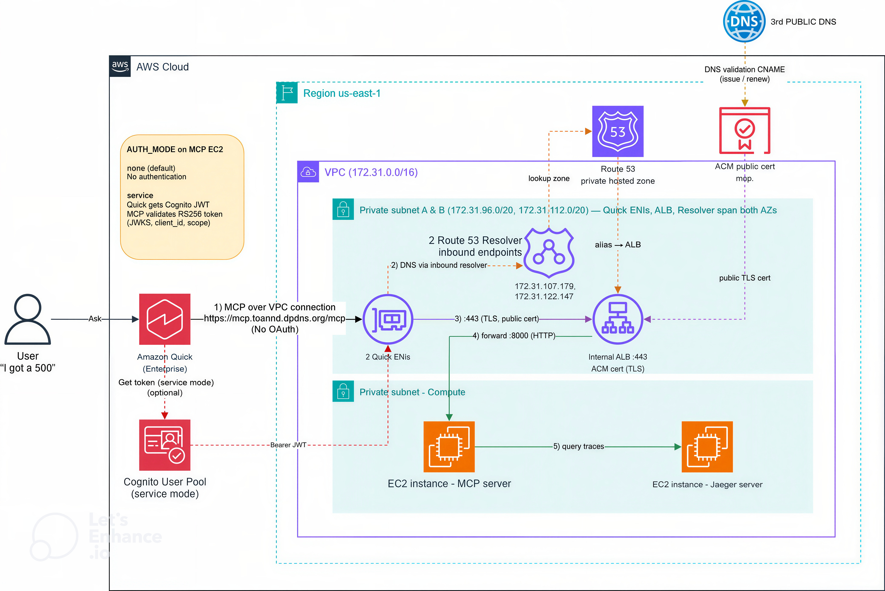

Amazon Quick là trợ lý AI doanh nghiệp: tìm kiếm dữ liệu, dựng agent, tự động hóa quy trình. Nó kết nối hệ thống ngoài qua **MCP connector**. Nhưng nhiều hệ thống quan trọng lại nằm bên trong mạng riêng, và dữ liệu nhạy cảm thì không nên đi qua một MCP endpoint công khai.

Bài này ghi lại cách mình cho Amazon Quick gọi được một **MCP server private nằm hoàn toàn trong VPC**, qua một **Quick VPC connection**, với use case điều tra sự cố (incident response) trên dữ liệu trace của Jaeger. Bạn có thể không quan tâm tới bản thân MCP server, mà tập trung vào cách Quick kết nối tới một private MCP.

---

## Vấn đề

Cách thông thường để AI gọi vào hệ thống nội bộ là mở một endpoint public. Nhưng điều đó kéo theo:

- Dữ liệu nhạy cảm đi qua đường công cộng.
- Tăng bề mặt tấn công, ai trên internet cũng có thể dò tới.
- Khó tuân thủ các yêu cầu cô lập dữ liệu.

Yêu cầu đặt ra: AI vẫn dùng được dữ liệu, nhưng dữ liệu **không bao giờ rời mạng nội bộ**.

---

## Ý tưởng cốt lõi: public cert + private DNS

Toàn bộ thiết kế xoay quanh hai nguyên tắc nghe có vẻ mâu thuẫn nhưng lại bổ sung cho nhau:

- **Chứng chỉ công khai (public cert)**: ALB cần một chứng chỉ TLS được tin cậy công khai, tên khớp hostname, để bắt tay TLS thành công. ACM cấp miễn phí và tự gia hạn.
- **Tên miền riêng (private DNS)**: hostname `mcp.example.com` chỉ phân giải được bên trong VPC, hoàn toàn vô hình với internet công cộng.

Kết quả: TLS vẫn hợp lệ như một dịch vụ public bình thường, nhưng endpoint thật bị giấu hoàn toàn. Việc cấp chứng chỉ chỉ cần chứng minh quyền sở hữu domain, không yêu cầu hostname phải truy cập được công khai.

---

## Kiến trúc tổng thể



```text
User hỏi Amazon Quick
   │  Quick VPC connection (ENI đặt trong private subnet)
   ▼
[VPC]
   Quick ENI (private IP)
     ├─ hỏi DNS :53 ─► Route 53 Resolver inbound ─► Private hosted zone ─► IP private của ALB
     └─ HTTPS :443  ─► Internal ALB (TLS terminate, ACM cert)
                          └─ HTTP :8000 ─► MCP Server (EC2) ─► Jaeger
```

Mọi chặng đều dùng IP private, không có bước nào ra internet công cộng. Các thành phần chính:

| Thành phần | Vai trò |
| --- | --- |
| Quick VPC connection | Đặt ENI của Quick vào private subnet để traffic phát ra từ trong VPC |
| Route 53 Resolver inbound | IP DNS cố định để Quick phân giải hostname private |
| Private hosted zone | Trỏ hostname về ALB, chỉ thấy được trong VPC |
| Internal ALB + ACM cert | Kết thúc TLS, chuyển tiếp xuống MCP server |
| MCP server (EC2) | Chạy Jaeger + MCP app trên cổng 8000 |

---

## Vì sao dùng internal ALB mà không trỏ thẳng EC2

Về lý thuyết Quick có thể gọi thẳng IP EC2, nhưng có ALB ở giữa vì:

- **TLS**: ACM cert chỉ gắn được vào ALB, không gắn trực tiếp vào EC2. ALB là nơi giữ cert và kết thúc TLS.
- **Tên ổn định**: ALB có DNS name cố định để alias record trỏ tới. Private IP của EC2 đổi mỗi lần tạo lại instance.
- **Health check và mở rộng**: ALB tự kiểm tra `/health` và dễ thêm nhiều MCP server sau này.
- **Cách ly bảo mật**: chuỗi security group Quick ENI → ALB → MCP server, Quick không bao giờ chạm thẳng máy chứa dữ liệu.

---

## Split-horizon DNS: cùng tên, hai câu trả lời

Đây là phần thú vị nhất khi kiểm chứng. Hỏi DNS công khai địa chỉ của hostname sẽ ra rỗng:

```text
dig +short A mcp.example.com @1.1.1.1
# (trống — không có A record công khai)

dig mcp.example.com @1.1.1.1 | grep status
# status: NOERROR  → tên TỒN TẠI, chỉ là không có IP công khai
```

Điểm cần phân biệt: `NOERROR` nghĩa là tên hợp lệ nhưng không có địa chỉ, khác hẳn `NXDOMAIN` (tên không tồn tại). Bản ghi `hostname → ALB` chỉ nằm trong **private hosted zone**, vô hình với bên ngoài.

Còn từ bên trong VPC, cùng cái tên đó trả về IP private của ALB:

```text
getent hosts mcp.example.com
# 10.0.x.x  mcp.example.com
```

Trên DNS công khai thực ra chỉ có đúng một bản ghi: CNAME để ACM xác thực quyền sở hữu domain. Nó không trỏ tới server, chỉ phục vụ việc cấp chứng chỉ.

---

## Vì sao cần Resolver inbound endpoint

Một câu hỏi tự nhiên: ENI của Quick đã nằm trong VPC rồi, sao còn cần resolver?

Vấn đề là **"đường đi" khác với "phân giải tên"**. VPC connection cho Quick con đường vào mạng private (ENI có IP private). Nhưng Quick gọi MCP bằng *tên*, nên trước khi gửi gói tin phải đổi tên thành IP — đó là việc của DNS.

Một EC2 thường sẽ tự dùng **VPC resolver mặc định** (địa chỉ `.2`). Nhưng Amazon Quick **không dùng** resolver mặc định, và bạn cũng không thể điền địa chỉ `.2` vào cấu hình Quick. Vì vậy phải tạo **Route 53 Resolver inbound endpoint** để có các IP DNS thật (ví dụ `10.0.116.70`, `10.0.122.147`) mà Quick gửi truy vấn tới. Resolver này tra private hosted zone và trả về IP của ALB.

Thiếu nó, Quick sẽ báo lỗi `hostname cannot be resolved` ngay khi tạo connector.

Lưu ý thứ tự: phải tạo resolver inbound **trước**, lấy 2 IP, rồi mới đưa vào Quick VPC connection. Vì VPC connection cần 2 IP đó làm tham số đầu vào.

---

## Luồng request lúc chạy

```text
1. User hỏi Quick: "tôi bị lỗi 500 khi thanh toán"
2. Quick gọi MCP qua VPC connection, ENI hỏi DNS tới resolver inbound
3. Resolver tra private hosted zone, trả về IP private của ALB
4. Quick mở HTTPS :443 tới ALB, TLS kết thúc tại ALB bằng ACM cert
5. ALB chuyển tiếp HTTP :8000 xuống MCP server
6. MCP server query Jaeger, trả kết quả ngược lại theo đúng đường
```

---

## Xác thực: No-auth vẫn an toàn

Connector này chạy ở chế độ **No authentication**, và điều đó vẫn an toàn, vì bảo mật đến từ **cô lập mạng** chứ không phải mật khẩu:

- MCP server chỉ chấp nhận cổng 8000 từ security group của ALB.
- ALB chỉ chấp nhận 443 từ trong VPC và từ security group của Quick ENI.
- Hostname chỉ phân giải trong VPC, không có IP public, không có đường từ internet.

Chỉ những gì nằm trong VPC (hoặc qua Quick VPC connection) mới chạm được MCP server. Khi cần thêm một lớp danh tính, có thể bật **service-to-service OAuth**: Quick lấy Bearer JWT từ Cognito (client_credentials), MCP server validate JWT (RS256 qua JWKS, kiểm tra scope). Token endpoint của Cognito là public, thỏa mãn yêu cầu OAuth endpoint phải truy cập được công khai.

---

## Use case: điều tra sự cố

Sau khi tạo connector trong Amazon Quick (endpoint trỏ tới hostname private, connection type là named VPC connection, auth No authentication), Quick tự phát hiện các tool và đăng ký mỗi tool thành một action.

Khi hỏi assistant một câu bằng ngôn ngữ tự nhiên như "tôi bị lỗi 500 khi checkout", Quick gọi tool điều tra qua MCP, tool này query Jaeger và trả về chuỗi nguyên nhân gốc:

```text
checkout-service (500)
  └─ payment-service: "payment failed: bank timeout"
       └─ bank-api: "upstream bank gateway timeout after 3000ms"  ← root cause
  inventory-service: 200 OK
```

Từ câu hỏi tới root cause trong vài giây, và dữ liệu trace chưa từng rời VPC.

---

## Source code

Mã nguồn MCP server (FastAPI) dùng trong bài, gồm các tool query Jaeger và phần xác thực service-to-service OAuth tùy chọn, có ở GitHub:

- [github.com/toannd021104/jaeger-mcp](https://github.com/toannd021104/jaeger-mcp)

Server expose `GET /health` cho ALB target group và `POST /mcp` (JSON-RPC 2.0) cho `initialize`, `tools/list`, `tools/call`. Input schema của tool dùng JSON Schema Draft 7 đúng yêu cầu của Amazon Quick lúc publish connector.

---

## Vì sao chọn cách này

So với một private MCP target trên AgentCore Gateway:

- AgentCore Gateway có ingress public, cần thêm PrivateLink để đạt mức private tương đương.
- Nó thêm một hop quản lý (Gateway → VPC Lattice → ALB → EC2) và phát sinh phí xử lý dữ liệu của Lattice.
- Quick VPC connection là đường chính thức, first-class cho việc kết nối một private MCP server tới Quick: ít thành phần hơn, hỗ trợ No-auth, dùng networking VPC tiêu chuẩn mà team đã quen.

---

## Kết luận

Ý tưởng cốt lõi gói gọn trong "public cert + private DNS": chứng chỉ tin cậy công khai để TLS hợp lệ, nhưng tên chỉ phân giải trong VPC để dữ liệu không bao giờ rời mạng nội bộ. Quick VPC connection cho Quick con đường vào mạng riêng, còn resolver inbound cho Quick tấm bản đồ để biết hostname nằm ở IP nào. Có cả hai thì AI mới vừa hữu ích vừa an toàn: dùng được dữ liệu thật, mà dữ liệu không bao giờ ra internet.

Tài liệu AWS nên đọc thêm:

- [Amazon Quick permissions](https://docs.aws.amazon.com/quick/latest/userguide/permissions.html)
- [Route 53 Resolver inbound endpoints](https://docs.aws.amazon.com/Route53/latest/DeveloperGuide/resolver-getting-started.html)
- [Working with private hosted zones](https://docs.aws.amazon.com/Route53/latest/DeveloperGuide/hosted-zones-private.html)
- [Source code: jaeger-mcp](https://github.com/toannd021104/jaeger-mcp)
