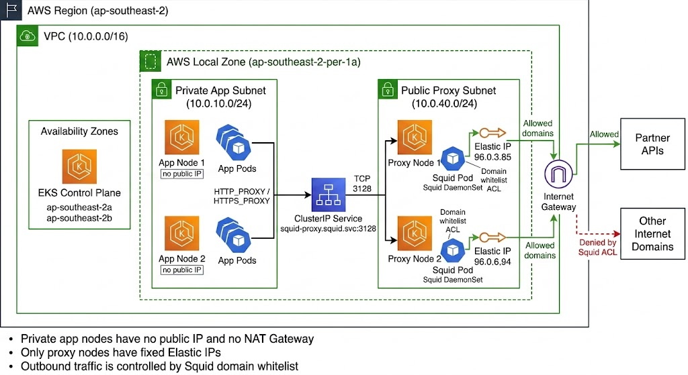
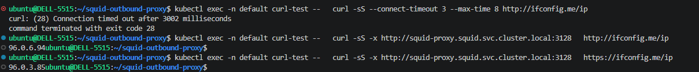
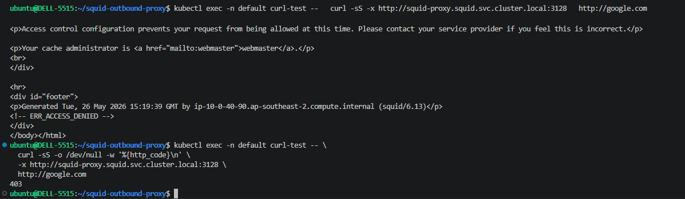

AWS Local Zone là phần mở rộng của một AWS Region, đặt gần một khu vực địa lý cụ thể hơn. Mục tiêu là đưa compute, storage và một số managed services tới gần user hoặc hệ thống on-prem để giảm latency.

Ví dụ workload vẫn thuộc region `ap-southeast-2`, nhưng worker nodes có thể chạy ở Local Zone `ap-southeast-2-per-1a`. Với các hệ thống cần gọi API partner gần khu vực đó, việc đặt workload ở Local Zone giúp traffic không phải đi vòng quá xa.

Nhưng Local Zone không đầy đủ như parent region. Khi dùng trong môi trường thật, thường cần để ý ba nhóm hạn chế:

- **Dịch vụ và tính năng ít hơn:** ít lựa chọn EC2 instance type hơn, nhiều dịch vụ như NAT Gateway, RDS, ElastiCache, FSx hoặc một số loại Load Balancer có thể không có sẵn tùy Local Zone.
- **Chi phí và data transfer:** tài nguyên trong Local Zone thường đắt hơn region chính, và traffic đi qua lại giữa Local Zone với parent region có thể phát sinh thêm phí mạng.
- **HA, vị trí và scale:** Local Zone không có nhiều AZ độc lập như region chính, không phải khu vực nào cũng có Local Zone, và nếu user/partner ở xa Local Zone thì latency chưa chắc tốt hơn.

Bài lab này tập trung vào một vấn đề rất thực tế: **app pods chạy trong private subnet cần gọi internet/partner API bằng fixed source IP, nhưng Local Zone không có NAT Gateway**.

---

## Bài toán

Trong môi trường doanh nghiệp, app nodes thường không nên public. Workload nên nằm trong private subnet, không public IP và không có internet trực tiếp.

Nhưng app vẫn cần đi ra Internet hoặc gọi Partner API bằng fixed source IP, đồng thời chặn các domain không nằm trong whitelist.

Ở region bình thường, cách quen thuộc là đi qua NAT Gateway. Ở Local Zone không có NAT Gateway, nên mình dùng hướng gần giống **NAT instance**, nhưng thay bằng **Squid forward proxy** để kiểm soát outbound ở mức domain.

---

## Ý tưởng

Flow mong muốn:

```text
App Pod trên private app node
  -> HTTP_PROXY / HTTPS_PROXY
  -> Squid ClusterIP Service trong EKS
  -> Squid Pod trên proxy node
  -> Elastic IP của proxy node
  -> Internet Gateway
  -> Partner APIs
```

---

## Kiến trúc



```text
AWS Region: ap-southeast-2
VPC: 10.0.0.0/16

EKS Control Plane
  - ap-southeast-2a
  - ap-southeast-2b

AWS Local Zone: ap-southeast-2-per-1a

Private App Subnet: 10.0.10.0/24
  - App Node 1: no public IP
  - App Node 2: no public IP
  - App Pods use HTTP_PROXY / HTTPS_PROXY

Public Proxy Subnet: 10.0.40.0/24
  - Proxy Node 1: Squid Pod + EIP 96.0.3.85
  - Proxy Node 2: Squid Pod + EIP 96.0.6.94
  - Route 0.0.0.0/0 -> Internet Gateway
```

App pod không đi thẳng ra Internet Gateway; toàn bộ outbound phải qua Squid service rồi ra ngoài bằng EIP của proxy node.

---

## Thực hiện

:::debug-accordion
::item 1. VPC và subnet

Tạo VPC `10.0.0.0/16`, một private subnet cho app nodes và một public subnet cho proxy nodes:

```hcl
resource "aws_vpc" "main" {
  cidr_block           = "10.0.0.0/16"
  enable_dns_hostnames = true
  enable_dns_support   = true

  tags = {
    Name = "frt-outbound-proxy-vpc"
  }
}

resource "aws_subnet" "app" {
  vpc_id                  = aws_vpc.main.id
  cidr_block              = "10.0.10.0/24"
  availability_zone       = var.local_zone
  map_public_ip_on_launch = false
}

resource "aws_subnet" "proxy" {
  vpc_id                  = aws_vpc.main.id
  cidr_block              = "10.0.40.0/24"
  availability_zone       = var.local_zone
  map_public_ip_on_launch = true
}

resource "aws_route_table" "proxy_public" {
  vpc_id = aws_vpc.main.id

  route {
    cidr_block = "0.0.0.0/0"
    gateway_id = aws_internet_gateway.main.id
  }
}
```

Vì app subnet private không có NAT, app pod không thể đi Internet trực tiếp. Đây là điều mình muốn giữ đúng với mô hình doanh nghiệp.

::item 2. VPC endpoints cho private nodes

App nodes nằm private subnet nên cần VPC endpoints để bootstrap EKS, pull image từ ECR và ghi log mà không cần NAT Gateway.

```hcl
locals {
  interface_vpc_endpoints = {
    ec2     = "com.amazonaws.${var.region}.ec2"
    ecr_api = "com.amazonaws.${var.region}.ecr.api"
    ecr_dkr = "com.amazonaws.${var.region}.ecr.dkr"
    logs    = "com.amazonaws.${var.region}.logs"
    sts     = "com.amazonaws.${var.region}.sts"
  }
}

resource "aws_vpc_endpoint" "interface" {
  for_each            = local.interface_vpc_endpoints
  vpc_id              = aws_vpc.main.id
  service_name        = each.value
  vpc_endpoint_type   = "Interface"
  private_dns_enabled = true
}

resource "aws_vpc_endpoint" "s3" {
  vpc_id            = aws_vpc.main.id
  service_name      = "com.amazonaws.${var.region}.s3"
  vpc_endpoint_type = "Gateway"
  route_table_ids   = [aws_route_table.app.id]
}
```

Đây là phần giúp app node private vẫn chạy được mà không cần mở internet trực tiếp.

::item 3. EKS node groups

Tách EKS worker nodes thành hai nhóm rõ vai trò:

```hcl
eks_managed_node_groups = {
  app_nodes = {
    subnet_ids     = [aws_subnet.app.id]
    instance_types = ["t3.medium"]
    min_size       = 2
    desired_size   = 2

    labels = {
      node-role = "app-node"
    }
  }

  proxy_nodes = {
    subnet_ids     = [aws_subnet.proxy.id]
    instance_types = ["t3.medium"]
    min_size       = 2
    desired_size   = 2

    labels = {
      node-role = "proxy-node"
    }

    taints = [{
      key    = "proxy-only"
      value  = "true"
      effect = "NO_SCHEDULE"
    }]
  }
}
```

App workloads chỉ chạy trên `app-node`. Squid chỉ chạy trên `proxy-node`.

Node security group cũng cần cho phép traffic nội bộ tới Squid port:

```hcl
node_security_group_additional_rules = {
  ingress_squid_from_vpc = {
    protocol    = "tcp"
    from_port   = 3128
    to_port     = 3128
    type        = "ingress"
    cidr_blocks = [var.vpc_cidr]
  }
}
```

::item 4. Elastic IP cho proxy nodes

Mỗi proxy node cần một Elastic IP cố định để partner whitelist. EIP phải được cấp đúng network border group của Local Zone:

```hcl
resource "aws_eip" "proxy_worker" {
  count                = 2
  domain               = "vpc"
  network_border_group = "ap-southeast-2-per-1"

  tags = {
    Role = "squid-outbound"
  }
}
```

Nếu dùng EIP mặc định ở parent region, EC2 trong Local Zone sẽ không associate được EIP.

::item 5. Auto-assign EIP cho proxy nodes

EIP được reserve trước, nhưng node group có thể recreate EC2. Lambda sẽ gắn EIP còn trống vào proxy node khi instance chuyển sang `running`.

```hcl
resource "aws_lambda_function" "eip_manager" {
  function_name = "${var.cluster_name}-eip-manager"

  environment {
    variables = {
      EIP_ALLOCATION_IDS = join(",", aws_eip.proxy_worker[*].allocation_id)
    }
  }
}

resource "aws_cloudwatch_event_rule" "ec2_state_change" {
  event_pattern = jsonencode({
    source      = ["aws.ec2"]
    detail-type = ["EC2 Instance State-change Notification"]
    detail      = { state = ["running", "terminated"] }
  })
}
```

Lambda chỉ xử lý instance có tag `proxy-node=true`, tránh gắn EIP nhầm sang app node.

::item 6. Squid DaemonSet và ClusterIP service

Squid được deploy bằng Helm dưới dạng DaemonSet:

```yaml
hostNetwork: true
dnsPolicy: ClusterFirstWithHostNet

ports:
  - containerPort: 3128
    hostPort: 3128

nodeSelector:
  node-role: proxy-node

tolerations:
  - key: proxy-only
    operator: Equal
    value: "true"
    effect: NoSchedule

service:
  type: ClusterIP
  port: 3128
```

`hostNetwork` và `hostPort` là điểm quan trọng: Squid dùng network stack của node, nên outbound traffic đi ra bằng EIP của proxy node.

::item 7. Domain whitelist bằng Terraform

Trong lab này mình chỉ whitelist `ifconfig.me` để test source IP. Khi chạy thật, chỉ cần thêm domain partner vào biến này.

```hcl
variable "partner_domains" {
  type    = list(string)
  default = ["ifconfig.me"]
}
```

Helm chart sẽ render list này thành Squid ACL. `google.com` không nằm trong whitelist nên Squid trả `403`.

::item 8. App workload dùng proxy

App chỉ cần cấu hình proxy env:

```yaml
env:
  - name: HTTP_PROXY
    value: http://squid-proxy.squid.svc.cluster.local:3128
  - name: HTTPS_PROXY
    value: http://squid-proxy.squid.svc.cluster.local:3128
  - name: NO_PROXY
    value: localhost,127.0.0.1,10.0.0.0/8,.cluster.local,.svc
```

Trong lab, mình dùng pod `curl-test` chạy trên app node private để kiểm tra flow.
:::

---

## Test

:::debug-accordion
::item 1. Pod placement: app private, Squid public proxy


`curl-test` chạy trên app node `10.0.10.246` và không có external IP. Hai Squid pods chạy trên proxy nodes `10.0.40.46` và `10.0.40.90`, mỗi node có một EIP riêng.

::item 2. App pod không có internet trực tiếp, nhưng đi được qua Squid



Direct curl từ app pod bị timeout. Khi thêm `-x http://squid-proxy.squid.svc.cluster.local:3128`, request ra ngoài thành công và source IP là EIP của proxy node.

::item 3. Domain ngoài whitelist bị Squid ACL chặn



`google.com` không nằm trong whitelist nên Squid trả `403`. Đây là expected behavior, không phải lỗi network.

::item 4. Log xác nhận traffic đi qua Squid


Log cho thấy app pod `10.0.10.145` gọi `ifconfig.me` được `200`, còn `google.com` bị `TCP_DENIED`. Đây là bằng chứng rõ nhất cho flow `private app pod -> Squid -> Internet`.
:::

---

*Source code: [github.com/toannd021104/squid-outbound-proxy](https://github.com/toannd021104/squid-outbound-proxy)*
